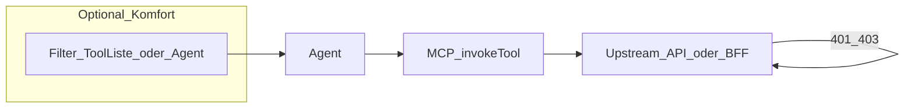

# API als Absicherung, Tool-Metadaten und Filtern

Dieses Dokument fasst die **vereinbarte Sicherheits- und Integrationsrichtung** zusammen (Diskussion Agent/MCP/DSL). Es ist **kein Implementierungsauftrag** für api2ai, sondern eine **Referenz** für spätere Features (z. B. `requiresPermissions` in der DSL, sealed credentials).

## Vertrauensgrenze

- **Autoritative Absicherung:** Die **Upstream-API** (Jira, Microsoft Graph, oder ein **BFF**, der strikt mit **User-/Tenant-Token** und serverseitiger Policy arbeitet) ist die **maßgebliche** Entscheidung über Zugriff. Antworten wie **401/403** (bzw. domaintypisch) sind die harte Linie.
- **Nicht ausreichend:** Sich allein auf **Agent-Verhalten**, **Tool-Listenfilter** oder **MCP** zu verlassen, um „Sicherheit“ zu ersetzen — Sprachmodelle halten Policies nicht zuverlässig ein, wenn Tools sichtbar oder aufrufbar bleiben.

## Filtern (nur Zweck: unnötige Tool Calls vermeiden)

- **Ziel:** Weniger sinnlose Aufrufe, weniger Rauschen in Logs/Audits, bessere UX fürs Modell — **nicht** Ersatz für API-Authz.
- **Variante A (bevorzugt in der Diskussion):** MCP kann **alle** Tools ausliefern; Metadaten pro Tool (z. B. `requiredPermissions`) + **Session-Kontext** (welche Rechte der User hat) stehen dem Agenten in Systemkontext/Prompt; der Agent **soll** nur passende Tools nutzen.
- **Variante B (dynamisches `tools/list` im MCP):** möglich, aber **aufwendiger** (Kontext pro Verbindung/Prozess: Env, HTTP-Auth, signierte `initialize`-Daten); nur nötig, wenn **jeder** MCP-Client ohne eure Host-Schicht zuverlässig gefilterte Listen braucht.

## DSL (zukünftig, optional)

- Pro **Operation** optional eine Liste **deklarativer** Anforderungen, z. B. `requiresPermissions: ["…"]` — Ausdruck der **Tool-Semantik**, nicht Auflösung „User X hat Recht Y“.
- **User-Rechte** kommen aus der **vorgeschalteten App** (Login, Session, IdP, OAuth-Scopes, Jira-Rollen …), nicht aus der DSL.

## Token und Tenant

- **Kurzlebige Tokens** von der App (z. B. versiegelt durchgereicht, siehe [done/github-sealed-bearer.plan.md](done/github-sealed-bearer.plan.md) bzw. Archiv [obsolete/mcp-sealed-token-auth.md](obsolete/mcp-sealed-token-auth.md)): Session/Refresh bleiben in der **App**; MCP führt **kein** OAuth-/Session-Management im Sinne von Identity (Variante „A“ aus Auth-Diskussion).
- **Tenant / Host:** Was nicht im Token steckt, muss **pro Aufruf** stimmen — entweder bereits als **OpenAPI-Parameter** (Path/Query/Header) in den Tool-Args, oder (falls nötig) **laufzeitfähige `baseUrl`** / Mandanten-Host — typischerweise von der **App** mitgegeben, nicht als Session im MCP.

## BFF-Warnung

Wenn ein Dienst mit **breiten** Rechten im Namen vieler User arbeitet und die User-Policy **nicht** strikt serverseitisch pro Request durchsetzt, ist „die API“ die **falsche** psychologische Grenze — dann muss **dieser** Dienst die Absicherung sein.

## Testen mit Cursor (Simulation im Prompt)

Cursor liefert **nicht** automatisch eure Produkt-Session oder Mandanten-Rechte. Für **Entwicklungstests** der Agent-Seite reicht oft eine **explizite Prompt-Instruktion**, z. B.:

- Simuliere einen User mit den Rechten **A**, **B** (namentlich wie in euren `requiredPermissions`-Strings).
- Wähle Tools nur, wenn deren **`requiredPermissions`** eine Teilmenge der simulierten Rechte ist (oder nach eurer definierten Regel).

**Nutzen:** Ihr übt Modell-Verhalten und Tool-Auswahl ohne vorgeschaltete App.

**Grenze:** Das bleibt **Anweisung an ein LLM** — nicht verlässlich als Absicherung; die **Upstream-API** (mit passend eingeschränktem Token) bleibt der echte Test der harten Grenze.

**Nur Tests:** Ein **`sealedCredential`**-Blob darf man für **lokales Ausprobieren** in den Prompt legen und das Modell anweisen, ihn unverändert ans Tool zu geben — akzeptabel im **Test**-Rahmen (Chat kann sensible Testdaten enthalten; lange Blobs können vom Modell verfälscht werden).

## Referenz-Dateien im Repo

- Aktuelle Auth in der DSL: [`packages/language/src/api-2-ai-dsl.langium`](packages/language/src/api-2-ai-dsl.langium)
- Plan GitHub + sealed bearer (erledigt): [done/github-sealed-bearer.plan.md](done/github-sealed-bearer.plan.md) · Archiv: [obsolete/mcp-sealed-token-auth.md](obsolete/mcp-sealed-token-auth.md)
