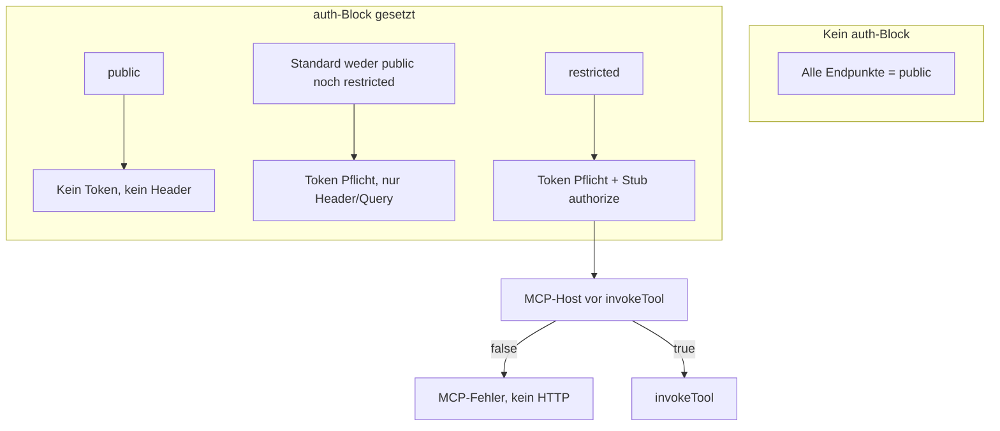
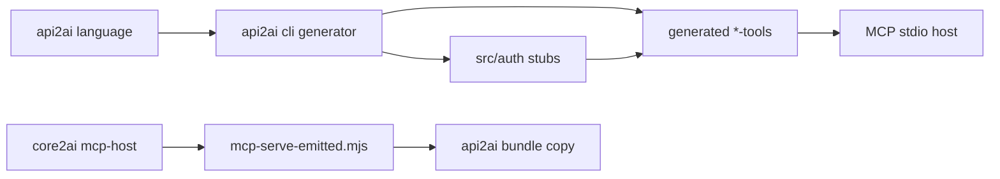

# api2ai: Auth verbessern + generierten Code linten

## Ausgangslage

Heute ([`api-2-ai-dsl.langium`](packages/language/src/api-2-ai-dsl.langium)):

- Optionaler globaler `auth`-Block: `in`, `name`, `prefix`, `fromJwt`
- Pro Operation nur `public`
- Ohne `auth` → kein Credential-Runtime (`authKind: 'none'`)
- Mit `auth` → **alle** nicht-`public`-Tools brauchen `--auth-env`; `invokeTool` setzt Header, aber [`resolveHostContext`](packages/cli/src/generator/host-adapter-render.ts) verlangt **immer** ein Credential, auch für `public` (Bug; E2E nutzt Dummy-Token)

Generierter Demo-Code unter [`packages/extension/demos/generated/tools/`](packages/extension/demos/generated/tools/) ist per [eslint.config.js](eslint.config.js) komplett von ESLint ausgeschlossen und nicht in `tsc -b` enthalten — nur Prettier auf committed `*-tools.ts`.

---

## Ziel-Zugriffsmodell (Schritt 1)



| Kennzeichnung   | Token (`--auth-env`) | Custom-Check | HTTP-Auth-Header |
| --------------- | -------------------- | ------------ | ---------------- |
| _(kein `auth`)_ | nein                 | nein         | nein             |
| `public`        | nein                 | nein         | nein             |
| _(default)_     | ja                   | nein         | ja               |
| `restricted`    | ja                   | ja (Stub)    | ja               |

**`claims` im `auth`-Block** (ersetzt `fromJwt` in Schritt 1):

```langium
auth {
    in: header
    name: "Authorization"
    prefix: "Bearer "
    claims {
        customerId: string
        role: string
    }
}

GET "/orders/{customerId}" {
    toolName: "listCustomerOrders"
  ...
    restricted
}
```

- `claims`-Typen: zunächst `string` | `number` | `boolean` (einfache Literale; Validator prüft Duplikate/leere Keys).
- **Schritt 1:** `claims` dienen Typ/Kontext für Stubs und Dokumentation; **kein** automatisches Weglassen von Path/Query-Parametern aus JWT (das kommt in Schritt 2 am Tool).
- **`fromJwt` entfernen**; Demo [`mock-api.api2ai`](packages/extension/demos/mock-api.api2ai) bis Schritt 2: `customerId` wieder als normales Tool-Argument (Agent muss ID kennen/übergeben) oder Demo kurz ohne `{customerId}` im Path — im Plan als Breaking Change dokumentieren.

**Mutual exclusion:** Validator-Fehler, wenn `public` und `restricted` gemeinsam gesetzt; `restricted` ohne `auth`-Block.

**Genau ein `auth` pro Datei (festgelegt):**

- Pro `.api2ai`-Datei höchstens **ein** `auth { … }`-Block (Grammatik: `('auth' auth=Auth)?` am Model — bleibt so).
- **Keine** zweite Auth-Variante, kein `auth`-Array, keine Profile wie „API-Key + OAuth parallel“ in Schritt 1 oder 2.
- Validator: falls später jemand die Grammatik erweitert — explizit **Error** bei mehr als einem `auth`-Block (defensiv, falls Parser-Regel lockert wird).
- OAuth2-Flows, Refresh-Tokens und „mehrere Auth-Profile“ sind **out of scope**; sie würden eine zweite Auth-Quelle erfordern und sind damit ausgeschlossen.

---

## Schritt 1 — Implementierung

### 1. Sprache (Langium)

Dateien: [`api-2-ai-dsl.langium`](packages/language/src/api-2-ai-dsl.langium), [`api-2-ai-dsl-validator.ts`](packages/language/src/api-2-ai-dsl-validator.ts), [`api-2-ai-dsl-completion-provider.ts`](packages/language/src/api-2-ai-dsl-completion-provider.ts), Grammar-Tests.

- `Auth`: `fromJwt` → `claims ClaimsSpec?`
- `ClaimsSpec`: `{` (`claims` += ClaimEntry)\* `}`
- `ClaimEntry`: `name=ID ':' type=ClaimType`
- `Operation`: `(public?='public' | restricted?='restricted')?` (max. eines)
- `checkAuth`: `claims` optional; wenn `restricted`-Ops existieren, sinnvoller Hinweis wenn `claims` fehlt (Warning oder Error — Empfehlung: **Warning**, Stub nutzt dann `Record<string, unknown>`)

### 2. Codegen ([`packages/cli/src/generator*.ts`](packages/cli/src/generator.ts))

**Tool-Metadaten** (`GeneratedTool`):

```ts
access: 'public' | 'protected' | 'restricted';
```

(`protected` = bisheriges Default ohne Flag.)

**Auth-Config export** (ersetzt `fromJwt`):

```ts
export const authClaims = { customerId: 'string', role: 'string' } as const;
export type AuthClaims = { customerId: string; role: string };
```

**Per-Tool-Stubs** (write-once, nicht in `generated/`):

- Pfad relativ zur `.api2ai`-Datei: `{projectRoot}/src/auth/<toolName>.mjs`
- Beim ersten Generate (nur wenn Datei fehlt): Stub mit `export function authorize(context) { return false; }` und JSDoc/`@typedef` aus `claims`
- Optional parallel: `src/auth/<toolName>.ts` + esbuild-Schritt in `generateOutput` (`src/auth/*.ts` → `.mjs`), damit Entwickler TypeScript nutzen können, MCP aber weiter `.mjs` lädt
- Generiertes `*-tools.mjs` importiert: `import { authorize as authorizeListCustomerOrders } from '../../src/auth/listCustomerOrders.mjs'`

**Pre-invoke-Hook im generierten Modul** (nicht DSL-spezifisch im Host hardcoden):

```ts
export async function assertToolAuthorized(toolName, hostContext) {
    const tool = toolByName[toolName];
    if (tool.access === 'public') return;
    if (!hostContext.credential) throw new Error('Missing credential...');
    if (tool.access === 'restricted') {
        const ok = await authorizeX({ credential, jwt: hostContext.jwt, claims: hostContext.jwt });
        if (!ok) throw new Error('Not authorized for this tool.');
    }
}
```

- `resolveHostContext`: Credential nur verlangen, wenn das **aufgerufene** Tool nicht `public` ist (Parameter `forToolName` oder Aufteilung: `resolveHostContext` + `requireCredential(tool)`).
- `requiresAuth` / `validateAtStartup`: weiterhin true, wenn mindestens ein nicht-`public`-Tool existiert.

### 3. MCP-Host ([`core2ai/packages/mcp-host`](core2ai/packages/mcp-host))

Erweiterung [`GeneratedMcpModule`](core2ai/packages/mcp-host/src/mcp-host-adapter.ts) + [`runMcpServer`](core2ai/packages/mcp-host/src/mcp-server.ts):

- Optionales Export `assertToolAuthorized` (async)
- Vor `invokeTool`: `await assertToolAuthorized?.(tool.toolName, hostContext)`; bei Fehler MCP-Response mit klarem Text (kein HTTP)

Danach: `npm run bundle:mcp-runtime` in api2ai, Demos `generated/cli/mcp-serve.mjs` regenerieren.

### 4. Beschreibungen & Tests

Siehe Abschnitt **Test-Anpassungen** unten.

### 4a. Test-Anpassungen (konkret)

| Bereich                         | Datei                                                                                                                                                            | Anpassung                                                                                                                                                                                                                                                                                                      |
| ------------------------------- | ---------------------------------------------------------------------------------------------------------------------------------------------------------------- | -------------------------------------------------------------------------------------------------------------------------------------------------------------------------------------------------------------------------------------------------------------------------------------------------------------- |
| Language — Parsing              | [`packages/language/test/parsing.test.ts`](packages/language/test/parsing.test.ts)                                                                               | `fromJwt`-Test → `claims`; neuer Parse für `restricted`; ggf. Test dass zweites `auth` nicht parst                                                                                                                                                                                                             |
| Language — Validation           | [`packages/language/test/validating.test.ts`](packages/language/test/validating.test.ts)                                                                         | `fromJwt`-Leer-Test entfernen; neu: `public`+`restricted`, `restricted` ohne `auth`, doppelte Claim-Keys, leerer Claim-Name                                                                                                                                                                                    |
| Language — Completion           | [`packages/language/test/completions.test.ts`](packages/language/test/completions.test.ts)                                                                       | Auth-Reihenfolge: `in`, `name`, `prefix`, `claims` statt `fromJwt`; Operation: `restricted` neben `public`                                                                                                                                                                                                     |
| CLI — E2E MCP                   | [`packages/cli/test/e2e/mcp-smoke-mock-api.ts`](packages/cli/test/e2e/mcp-smoke-mock-api.ts)                                                                     | `login` **ohne** `--auth-env` / ohne Dummy-Credential (Bugfix-Verifikation); optional zweiter Smoke: `listCustomerOrders` mit JWT + Stub `authorize → true`                                                                                                                                                    |
| CLI — Integration               | [`packages/cli/test/integration/mock-api-direct-invoke.test.ts`](packages/cli/test/integration/mock-api-direct-invoke.test.ts)                                   | Nach Generate: Stubs unter `fixtureRoot/src/auth/` (write-once); `listCustomerOrders` als `restricted` — vor `invokeTool` `assertToolAuthorized` aufrufen **oder** Stub auf `true` setzen; `pathParams: { customerId: 'alice' }` explizit (kein `fromJwt`-Omit bis Schritt 2); ggf. Case Stub `false` → Fehler |
| CLI — Generator (neu/erweitert) | z. B. `packages/cli/test/unit/generator-auth.test.ts`                                                                                                            | Golden-Snippets: `access`, `authClaims`, Import aus `src/auth/…`, Export `assertToolAuthorized`                                                                                                                                                                                                                |
| Demos (committed)               | [`mock-api.api2ai`](packages/extension/demos/mock-api.api2ai), [`generated/tools/mock-api-tools.ts`](packages/extension/demos/generated/tools/mock-api-tools.ts) | DSL + regenerieren; committed Stub [`packages/extension/demos/src/auth/listCustomerOrders.mjs`](packages/extension/demos/src/auth/listCustomerOrders.mjs) (Beispiel-Implementierung)                                                                                                                           |
| Lint                            | CI/`check`                                                                                                                                                       | Nach `generate:all`: ESLint auf `demos/generated/tools/*.ts` grün                                                                                                                                                                                                                                              |

**Hinweis Integration vs. E2E:** `mock-api-direct-invoke` ruft `invokeTool` direkt auf (ohne MCP-Host). Dort entweder `assertToolAuthorized` explizit testen oder separat nur im MCP-Smoke die Host-Kette (`assertToolAuthorized` → `invokeTool`) absichern — Empfehlung: **beides** (Integration für Stub+JWT+Path-Args, E2E für public ohne Credential + optional restricted via stdio).

**Tmp-Fixtures:** E2E/Integration kopieren `mock-api.api2ai` ins Temp-Verzeichnis und rufen `generateAction` auf — Stubs entstehen automatisch unter `{fixtureRoot}/src/auth/`; für restricted-Tests Stub im Temp auf `return true` patchen oder feste Test-Implementierung im committed Demo-Stub wiederverwenden (Copy mit Stub-Datei).

### 5. Breaking Changes / Migration (Schritt 1)

- Alle `.api2ai` mit `fromJwt` → `claims { ... }` umstellen
- `mock-api`: `listCustomerOrders` auf `restricted` + Stub; Path-Param `customerId` wieder im Schema bis Schritt 2
- Extension/Code-Actions: Snippets für `claims`, `restricted`

---

## Schritt 2 (nur Skizze — nicht in Schritt 1)

Am **Tool** (nicht im globalen `auth`):

- Mapping Claim → Path/Query-Parameter (ersetzt altes `fromJwt`-Verhalten dezentral)
- Generator: Parameter aus Schema entfernen + Bindung in `invokeTool`
- Validator: Claim-Key existiert in `auth.claims`

Separater Plan nach Abschluss von Schritt 1.

---

## Generierten Code durch Linter prüfen

**Ziel:** Committed `*-tools.ts` in Demos (und künftige Consumer-Outputs) erfüllen dieselben ESLint-Regeln wie Handcode — ohne `generated/cli` und Langium-`src/generated`.

| Maßnahme           | Detail                                                                                                                                                                      |
| ------------------ | --------------------------------------------------------------------------------------------------------------------------------------------------------------------------- |
| ESLint-Scope       | In [eslint.config.js](eslint.config.js) Ignore für `packages/extension/demos/generated/**` **entfernen**; stattdessen nur `generated/cli/**` und `*.mjs`-Bundles ignorieren |
| Generator-Qualität | Invoke/Adapter-Render so halten, dass `@typescript-eslint/no-unused-vars` etc. nicht triggern; ggf. gezielte `_`-Prefixe                                                    |
| Script             | `lint:generated`: `eslint packages/extension/demos/generated/tools/**/*.ts`                                                                                                 |
| CI                 | `npm run check` um `lint:generated` erweitern **oder** Demos-Pfad in globalem `lint` aufnehmen                                                                              |
| Optional (später)  | `tsc`-Projektreferenz für `demos/generated/tools` — Schritt 1 nur ESLint, kein zusätzliches typecheck-Zwang                                                                 |

Nach Generator-Änderungen: `npm run generate:all` in Demos, dann `npm run lint` / `lint:generated` grün.

---

## Abhängigkeiten zwischen Repos



Reihenfolge: **core2ai** (Host-Contract) → **api2ai** language/cli → bundle → Demos regenerieren.

---

## Wichtige Dateien (Schritt 1)

| Bereich | Dateien                                                                                                       |
| ------- | ------------------------------------------------------------------------------------------------------------- |
| DSL     | `packages/language/src/api-2-ai-dsl.langium`, validator, completion, tests                                    |
| Codegen | `generator.ts`, `module-render.ts`, `invoke-render.ts`, `host-adapter-render.ts`, neues `auth-stub-render.ts` |
| Host    | `core2ai/packages/mcp-host/src/mcp-server.ts`, `mcp-host-adapter.ts`                                          |
| Lint    | `eslint.config.js`, root `package.json` scripts                                                               |
| Demos   | `mock-api.api2ai`, `src/auth/*`, regenerierte `generated/tools/*`                                             |

---

## Nicht im Scope (Schritt 1)

- OpenAPI-`security`-Auto-Import
- Claim→Parameter-Mapping (Schritt 2)
- db2ai (eigenes Follow-up)
- OAuth2, Refresh-Tokens, **mehrere `auth`-Blöcke oder Auth-Profile pro Datei** (explizit ausgeschlossen)

---

## Klarheit / offene Punkte

| Thema                                                         | Status                                                                     |
| ------------------------------------------------------------- | -------------------------------------------------------------------------- |
| Ein `auth` pro `.api2ai`                                      | **Geklärt** — nur ein Block, keine Multi-Auth                              |
| Keyword `claims`, Stubs pro Tool in `src/auth/<toolName>.mjs` | **Geklärt**                                                                |
| `fromJwt` → `claims`; Path-Mapping                            | **Schritt 2**                                                              |
| `public` / default / `restricted`                             | **Geklärt**                                                                |
| Stub-Runtime `.mjs` (+ optional `.ts`→esbuild bei generate)   | **Geklärt** im Plan; bei Implementierung: esbuild nur wenn `.ts` existiert |
| `restricted` ohne `claims`-Block                              | **Warning**, Stub-Typ `Record<string, unknown>`                            |

**Keine weiteren inhaltlichen Rückfragen** für Schritt 1. Optional bei Umsetzung: ob `listCustomerOrders` in der Demo dauerhaft `restricted` bleibt oder nur im Test-Fixture — Empfehlung: Demo zeigt `restricted` + echter Stub als Referenz.
