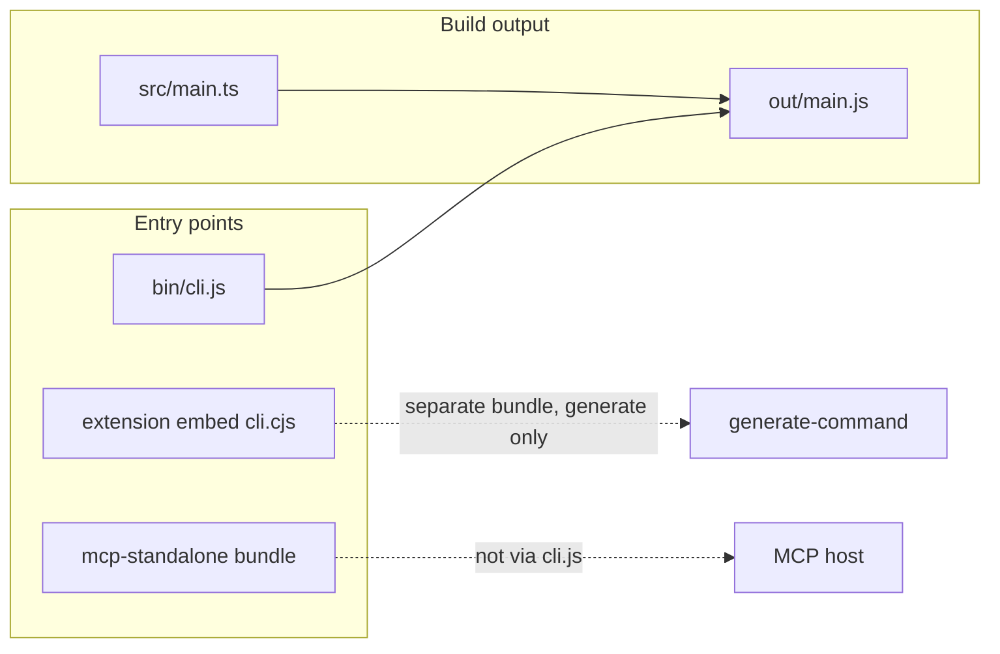

# api2ai Code Review: `packages/cli/bin/cli.js`

## Kurzantwort

**`cli.js` braucht ihr als ausführbaren Einstiegspunkt (npm `bin` + `node …/cli.js`).** Die Datei enthält nur Shebang und einen Aufruf von [`out/main.js`](packages/cli/out/main.js) — die echte CLI-Logik steht in [`packages/cli/src/main.ts`](packages/cli/src/main.ts) (Commander: `generate`, `smoke-generated`).

```1:4:packages/cli/bin/cli.js
#!/usr/bin/env node

import main from '../out/main.js';
main();
```

Ohne diesen Stub hättet ihr keinen Standardweg, die CLI direkt aus dem Repo oder nach `npm install` global/lokal zu starten.

---

## Warum nicht direkt `out/main.js` als `bin`?

| Aspekt                        | `bin/cli.js`                                   | Nur `out/main.js`                                      |
| ----------------------------- | ---------------------------------------------- | ------------------------------------------------------ |
| Shebang `#!/usr/bin/env node` | Handgeschrieben, stabil                        | TypeScript/`tsc` fügt keinen Shebang hinzu             |
| Pfad in `package.json` `bin`  | Fest unter `bin/`, unabhängig vom Build-Layout | Müsste bei jedem Build-Setup angepasst werden          |
| npm-Konvention                | Üblich: kleiner Stub in `bin/`                 | Ungewöhnlich, tooling erwartet oft `bin/*.js`          |
| ESM                           | Stub importiert kompiliertes Modul relativ     | Gleich möglich, aber `bin`-Datei bleibt trotzdem nötig |

Der Stub trennt **„was npm/Node als Programm startet“** von **„was der TypeScript-Build erzeugt“** (`out/`).

---

## Wo `cli.js` im System hängt



### 1. npm-Paket `api-2-ai-dsl-cli`

In [`packages/cli/package.json`](packages/cli/package.json):

```json
"bin": {
  "api-2-ai-dsl-cli": "./bin/cli.js"
}
```

Nach Installation (global oder als Dependency) steht der Befehl `api-2-ai-dsl-cli` zur Verfügung. `files` enthält explizit `"bin"`, damit der Stub im publizierten Paket landet.

### 2. Monorepo-Workflow (Hauptnutzung heute)

Root-[`package.json`](package.json) ruft überall `node ./packages/cli/bin/cli.js` auf (`generate:*`, `test:smoke`, …). Das ist der dokumentierte Weg in [`packages/cli/README.md`](packages/cli/README.md) und [`examples/README.md`](examples/README.md).

**Voraussetzung:** vorher `npm run langium:generate && npm run build`, damit `out/main.js` existiert — sonst scheitert der Import im Stub.

### 3. VS Code Extension (Entwicklung)

[`packages/extension/src/extension/main.ts`](packages/extension/src/extension/main.ts) sucht zuerst `packages/cli/bin/cli.js` im Workspace (Monorepo-Dev). **Im veröffentlichten VSIX** wird stattdessen [`out/embed-api2ai/cli.cjs`](packages/extension/out/embed-api2ai/cli.cjs) genutzt — gebündelt aus [`vscode-bundle-cli-entry.ts`](packages/cli/src/vscode-bundle-cli-entry.ts), **ohne** `cli.js` und **ohne** `smoke-generated`.

### 4. Was bewusst _nicht_ über `cli.js` läuft

- **MCP-Standalone:** [`mcp-bundle/mcp-standalone-entry.ts`](packages/cli/mcp-bundle/mcp-standalone-entry.ts) — eigener Bundle-Pfad für Endnutzer-MCP-Hosts.
- **Extension-Bundle:** schmaler `generate`-only-Einstieg, separat gebaut.

---

## Bewertung im Code-Review

**Behalten — sinnvoll und minimal.** Kein toter Code; der Stub erfüllt ein klares Architektur-Rolle.

Mögliche Review-Punkte (kein Muss zur Änderung):

1. **Namensdrift:** Paket/bin heißt `api-2-ai-dsl-cli`, Doku spricht oft von `api2ai` — nur Konsistenz/DX.
2. **Fehlendes `out/main.js`:** Stub wirft einen undurchsichtigen Import-Fehler, wenn nicht gebaut — optional freundliche Meldung im Stub (kleines Enhancement).
3. **Zwei CLI-Einstiege:** `main.ts` (voll) vs. `vscode-bundle-cli-entry.ts` (nur `generate`) — bei Review prüfen, ob Commander-Setup divergiert (TODO in `main.ts` Zeile 24: Program API).

---

## Nächste Schritte im ausführlichen api2ai-Review

Empfohlene Reihenfolge nach dem Einstieg:

1. [`packages/cli/src/main.ts`](packages/cli/src/main.ts) + [`generate-command.ts`](packages/cli/src/generate-command.ts) + [`generator.ts`](packages/cli/src/generator.ts) — Generate-Pipeline
2. [`packages/cli/mcp-bundle/`](packages/cli/mcp-bundle/) + [`resources/mcp-serve-emitted.mjs`](packages/cli/resources/mcp-serve-emitted.mjs) — MCP-Runtime
3. [`packages/language/`](packages/language/) — DSL, Langium, Validierung
4. [`packages/extension/`](packages/extension/) — LSP, Embed-Bundle, `resolveCliSpawn`
5. [`examples/`](examples/) — generierte Artefakte vs. Spec

Sag Bescheid, welchen Bereich wir als Nächstes tiefer reviewen sollen.
