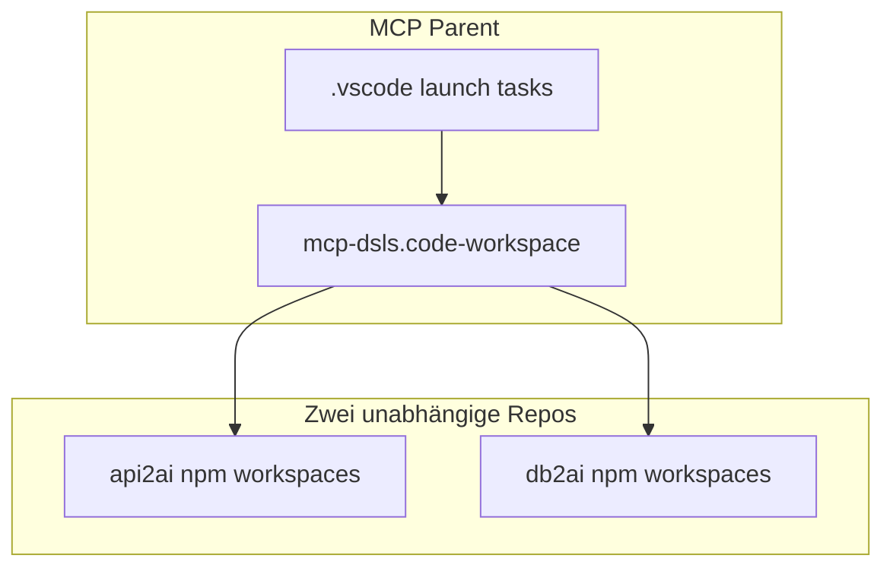

# Plan: db2ai anlegen + gemeinsamer Workspace

## Zielbild

| Aspekt | [api2ai](api2ai) (bestehend) | [db2ai](db2ai) (neu) |
|--------|------------------------------|----------------------|
| Eingabe | OpenAPI + `.api2ai` | Relationale DB + `.db2ai` |
| Ausgabe (später) | MCP-Tools aus HTTP-Ops | MCP-Tools aus DB-Schema/Queries |
| PoC-Stand | voll | **Skelett**: Grammar, LSP, Extension, leere Examples |

Pfad: **`/Users/annette/Documents/Projekte/MCP/db2ai`** (Geschwister von `api2ai`, nicht darin verschachtelt).

---

## Vorgehen (vereinbart)

1. **Schritt 1 — nur Parent-Workspace anlegen** (`mcp-dsls.code-workspace`, `MCP/.vscode/`, Plan-Kopie unter `MCP/.cursor/plans/`, leerer Platzhalter `db2ai/` damit der Multi-Root nicht fehlt).
2. **Du öffnest** `mcp-dsls.code-workspace` in Cursor und prüfst Explorer/Launch.
3. **Schritt 2+ — aus dem geöffneten Workspace** gemeinsam: `db2ai`-Skelett, Build, Dual-Extension-Test.

**Plan-Sichtbarkeit:** Der Plan bleibt in Cursor sichtbar, wenn er unter einem Workspace-Root liegt. Beim Parent-Workspace liegt die Kopie unter [`MCP/.cursor/plans/`](../../.cursor/plans/) (neben `api2ai/`), nicht nur in `api2ai/.cursor/plans/`. Die bestehende Datei in api2ai kann als Duplikat bleiben oder später entfernt werden.

---

## Kann alles im selben Workspace sein?

**Ja — empfohlen als Multi-Root-Workspace im Parent**, nicht als ein gemeinsames Git-Monorepo.



- **Zwei separate Repos** (`api2ai/`, `db2ai/`): eigene `package-lock.json`, eigener Build, klare Grenzen.
- **Eine `.code-workspace`-Datei** im Parent: beide Roots in einer Cursor/VS-Code-Instanz zum Bearbeiten.
- Datei: [`/Users/annette/Documents/Projekte/MCP/mcp-dsls.code-workspace`](/Users/annette/Documents/Projekte/MCP/mcp-dsls.code-workspace)

```json
{
  "folders": [
    { "name": "api2ai", "path": "api2ai" },
    { "name": "db2ai", "path": "db2ai" }
  ],
  "settings": {}
}
```

**Arbeitsmodus:** `mcp-dsls.code-workspace` öffnen (CLI: `cursor /Users/annette/Documents/Projekte/MCP/mcp-dsls.code-workspace` oder Doppelklick). Nicht nur den `api2ai`-Ordner — sonst fehlt `db2ai` im Explorer.

Das bestehende Parent-[`package.json`](/Users/annette/Documents/Projekte/MCP/package.json) (Yo/Langium-Generator) bleibt optional für einmalige Scaffolding-Nutzung; **kein** npm-Workspace-Zwang über beide Projekte.

---

## Launch: beide DSLs + beide `examples/` testen?

**Ja — mit einer Extension-Development-Host-Konfiguration im Parent.**

VS Code/Cursor unterstützen **mehrere** `--extensionDevelopmentPath` in einer `launch.json` ([Stack Overflow](https://stackoverflow.com/questions/51448347/how-can-you-launch-vscode-with-multiple-extensiondevelopmentpath-sources)). Der Dev-Host öffnet dann eine **Workspace-Datei** (nicht nur einen Ordner), sodass beide Example-Bäume sichtbar sind:

[`/Users/annette/Documents/Projekte/MCP/.vscode/launch.json`](/Users/annette/Documents/Projekte/MCP/.vscode/launch.json) (neu im Parent):

```json
{
  "version": "0.2.0",
  "configurations": [
    {
      "name": "Run Both DSL Extensions",
      "type": "extensionHost",
      "request": "launch",
      "preLaunchTask": "Build all DSLs",
      "args": [
        "${workspaceFolder}/mcp-dsls.code-workspace",
        "--extensionDevelopmentPath=${workspaceFolder}/api2ai/packages/extension",
        "--extensionDevelopmentPath=${workspaceFolder}/db2ai/packages/extension"
      ],
      "sourceMaps": true,
      "outFiles": [
        "${workspaceFolder}/api2ai/packages/language/out/**/*.js",
        "${workspaceFolder}/api2ai/packages/extension/out/**/*.js",
        "${workspaceFolder}/db2ai/packages/language/out/**/*.js",
        "${workspaceFolder}/db2ai/packages/extension/out/**/*.js"
      ]
    }
  ]
}
```

Zugehörige [`tasks.json`](/Users/annette/Documents/Projekte/MCP/.vscode/tasks.json):

```json
{
  "version": "2.0.0",
  "tasks": [
    {
      "label": "Build all DSLs",
      "dependsOn": ["Build api2ai", "Build db2ai"],
      "dependsOrder": "parallel"
    },
    {
      "label": "Build api2ai",
      "type": "shell",
      "options": { "cwd": "${workspaceFolder}/api2ai" },
      "command": "npm run langium:generate && npm run build"
    },
    {
      "label": "Build db2ai",
      "type": "shell",
      "options": { "cwd": "${workspaceFolder}/db2ai" },
      "command": "npm run langium:generate && npm run build"
    }
  ]
}
```

**Ablauf:** Parent-Workspace öffnen → F5 **Run Both DSL Extensions** → neues Fenster (Extension Development Host) mit `mcp-dsls.code-workspace`, beiden Extensions aktiv, `api2ai/examples/` und `db2ai/examples/` im Explorer.

**Wichtige Anpassungen gegenüber api2ai allein:**

| Thema | Maßnahme |
|-------|----------|
| LSP-Debug-Port | api2ai nutzt Port **6009** ([`packages/extension/src/extension/main.ts`](api2ai/packages/extension/src/extension/main.ts)). db2ai: **`DEBUG_SOCKET=6010`** in eigener Launch-Env oder Default in db2ai-Extension |
| Language-IDs | `api-2-ai-dsl` vs. `db-2-ai-dsl` — keine Kollision |
| Pro Projekt weiter F5 | In `api2ai/.vscode/launch.json` bleibt **Run Extension** (öffnet nur `api2ai/examples`) — unverändert nutzbar |

**Einschränkung:** Das startet den **Extension Development Host** (Debug-Fenster), nicht „eine zweite Cursor-Hauptinstanz“. Für normales Editieren reicht ein Fenster mit `mcp-dsls.code-workspace`; F5 öffnet das zweite Fenster mit beiden DSLs — genau das übliche Langium-Muster, skaliert auf zwei Extensions.

MCP-Demos in `examples/` (Cursor MCP-Server) sind im Skelett **noch nicht** nötig; später pro Projekt wie bei api2ai.

---

## db2ai-Projektstruktur (Skelett)

Von [`api2ai`](api2ai) **strukturell klonen**, OpenAPI/MCP-Codegen **entfernen/stubben**:

```
db2ai/
├── package.json              # workspaces: language, cli, extension
├── tsconfig.json / tsconfig.build.json
├── README.md                 # Vision: DB → MCP, Checkliste (minimal)
├── .gitignore
├── .cursor/rules/            # langium-generate-build.mdc (wie api2ai)
├── .vscode/                  # launch, tasks, settings (langium.config Pfad)
├── docs/
│   ├── README.md             # Platzhalter
│   └── architecture-sketches.md
├── examples/                 # LEER außer:
│   ├── README.md             # „Demos folgen“
│   └── .gitkeep
└── packages/
    ├── language/
    │   ├── langium-config.json   # id: db-2-ai-dsl, ext: .db2ai
    │   ├── src/db-2-ai-dsl.langium # minimale Grammar
    │   ├── src/db-2-ai-dsl-module.ts
    │   ├── src/db-2-ai-dsl-validator.ts  # minimal/leer
    │   └── test/parsing.test.ts    # 1 Smoke-Test
    ├── cli/
    │   ├── bin/cli.js
    │   └── src/main.ts             # z.B. nur `validate` / `parse`, kein Generator
    └── extension/
        ├── package.json            # vscode-db2ai, .db2ai
        └── src/...                 # Langium-Extension-Template wie api2ai
```

### Minimale Beispiel-Grammar (Startpunkt)

Statt leerer Grammar ein **kleines, gültiges** Modell (besser für Langium-Tests und Extension-Aktivierung):

```langium
grammar Db2AiDsl

entry Model:
    'database' connection=STRING
    (operations += Operation)*;

Operation:
    'query' name=STRING '{'
        'toolName' ':' toolName=STRING
        'intent' ':' intent=STRING
    '}';

terminal STRING: /"(\\.|[^"\\])*"|'(\\.|[^'\\])*'/;
hidden terminal WS: /\s+/;
```

Optional eine Datei [`examples/hello.db2ai`](db2ai/examples/hello.db2ai) als einziges Demo — oder `examples/` wirklich leer lassen (nur README); du hattest „leer“ gewünscht → **kein** committed Demo, nur README.

### Umbenennungen (systematisch)

| api2ai | db2ai |
|--------|-------|
| `Api2AiDsl` | `Db2AiDsl` |
| `api-2-ai-dsl` | `db-2-ai-dsl` |
| `.api2ai` | `.db2ai` |
| `api-2-ai-dsl-language` | `db-2-ai-dsl-language` |
| `vscode-api2ai` | `vscode-db2ai` |

CLI/Extension: **kein** `bundle:mcp-runtime`, **kein** `embed-cli-bundle` im ersten Schritt (oder leerer Stub), damit der Skelett-Build schnell grün ist.

### Root-Scripts (db2ai)

Analog api2ai, reduziert:

- `langium:generate`, `build`, `test` (vitest language)
- Keine `generate:*` / `test:mcp` bis DB-Codegen existiert

Nach jeder Änderung außerhalb `examples/`: `npm run langium:generate && npm run build` (Cursor-Rule wie in api2ai).

---

## Implementierungsschritte

### Phase 1 — Parent-Workspace (erster Schritt, vor db2ai-Skelett)

Anlegen unter `/Users/annette/Documents/Projekte/MCP/`:

| Datei/Ordner | Inhalt |
|--------------|--------|
| `mcp-dsls.code-workspace` | Multi-Root: `api2ai` + `db2ai` (Platzhalter) |
| `.vscode/launch.json` | Zunächst **Run api2ai Extension** (funktioniert sofort); **Run Both DSL Extensions** vorbereitet, aktiv sobald `db2ai/packages/extension` existiert |
| `.vscode/tasks.json` | `Build api2ai` sofort; `Build db2ai` mit Hinweis/fehlendem Ordner bis Phase 2 |
| `.vscode/extensions.json` | `langium.langium-vscode` empfehlen |
| `README.md` (Parent) | Kurz: Workspace öffnen, Plan unter `.cursor/plans/` |
| `db2ai/README.md` | Platzhalter: „Projekt folgt in Phase 2“ |
| `.cursor/plans/db2ai_geschwisterprojekt_6053e67a.plan.md` | **Kopie** dieses Plans (Hauptreferenz im Parent-Workspace) |

**Phase 1 erledigt.** Als Nächstes: `cursor /Users/annette/Documents/Projekte/MCP/mcp-dsls.code-workspace` öffnen → Explorer zeigt `api2ai` und `db2ai` → F5 **Run api2ai Extension** testen → Phase 2 starten.

### Phase 2 — db2ai-Skelett

1. Platzhalter `db2ai/` durch echtes Monorepo ersetzen (`git init`, `.gitignore` von api2ai adaptieren).
2. `packages/language|cli|extension`, Root-TS-Configs kopieren/adaptieren.
3. `npm install` → `langium:generate` → `build`.
4. Validator/Completion minimal; CLI `parse`/`validate`; Extension für `.db2ai` ohne Codegen.
5. Parent-`tasks.json`/`launch.json`: **Run Both DSL Extensions** freischalten.

### Phase 3 — Dual-DSL verifizieren

1. Parent-Workspace → F5 **Run Both DSL Extensions**.
2. Dev-Host: `.api2ai` und `.db2ai` → Syntax/Validation beider Sprachen.
3. db2ai LSP-Port **6010**; Attach-Config dokumentieren.

### Phase 4 — api2ai optional

- Hinweis in [api2ai/README.md](api2ai/README.md) unter „Entwicklung“: Link auf Parent-Workspace.

---

## Was bewusst nicht im Skelett liegt

- DB-Connector, Schema-Introspection, SQL-Parser, MCP-Tool-Codegen
- `examples/generated/`, `examples/openapi/`, MCP `mcp.json`
- Gemeinsame npm-Workspaces über api2ai+db2ai (höhere Kopplung, wenig Nutzen)

Diese Schritte sind **Folge-Phasen** nach dem Skelett.

---

## Risiken / Fallstricke

- **Zwei `node_modules`:** je Projekt `npm install` (Parent-`node_modules` von altem Yo-Setup nicht mit db2ai verwechseln).
- **Langium VS Code Extension:** in Parent-`extensions.json` `langium.langium-vscode` empfehlen.
- **Workspace-Pfad:** Launch/Task `${workspaceFolder}` bezieht sich auf den **Parent**, wenn `mcp-dsls.code-workspace` geöffnet ist — deshalb Launch-Configs im Parent, nicht nur in api2ai.
- **Cursor vs. VS Code:** `extensionHost`-Launch funktioniert in Cursor gleich; CLI-Binary heißt `cursor` statt `code`.
