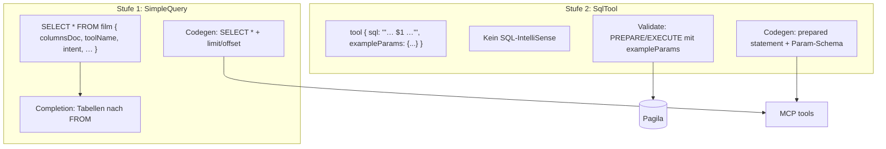

# Plan: db2ai Hybrid (Simple Table + Plain SQL)

## Kritische Bewertung — ist das eine gute Idee?

**Kurz: Ja, für euren PoC und eure Zielgruppe (Agent + Pagila-Demo) ist das eine sinnvolle, pragmatische Idee.** Nicht perfekt, aber besser als die DSL weiter aufzublähen oder nur rohes SQL ohne Struktur.

### Stärken

| Punkt | Warum |
|--------|--------|
| **Zwei klare Stufen** | 80 % „Tabelle listen“ braucht kein SQL-Design; 20 % komplexe Fälle bekommen volle SQL-Power. |
| **Wiederverwendung** | Tabellen-Completion, `database env`, Generate-on-Save, MCP-Host bleiben. |
| **Agent-tauglich** | Einfache Tools: festes Verhalten + `columnsDoc` erklärt Felder menschlich. SQL-Tools: `intent`/`summary` + `exampleParams` erzwingen durchdachte Doku. |
| **Validierung mit echter DB** | SQL-Fehler vor MCP, nicht erst im Agent-Lauf — passt zu „PoC muss laufen“. |
| **Kein SQL-IntelliSense** | Spart Wochenarbeit; Validierung ersetzt „Syntaxhilfe im String“. |

### Risiken / Schwächen

| Risiko | Mitigation im Plan |
|--------|---------------------|
| **Zwei Tool-Arten** | Klare Syntax (`SELECT * FROM` vs. `tool { sql: '''…''' }`); Generator erzeugt einheitliches MCP-Format. |
| **`columnsDoc` manuell** | Pflegeaufwand; Validator kann **Warning** wenn leer; Pagila-Beispiele gut pflegen. Später optional Auto-Ergänzung aus Schema. |
| **SQL-Validierung = Execute** | Nur mit **Read-only**-Transaktion + Timeout; `exampleParams` Pflicht; optional verbotene Keywords (`DROP`, `TRUNCATE`). |
| **Parameter `$1…$n`** | Agent darf nur Werte liefern, nie SQL-Text — im generierten Code strikt `pg` prepared. |
| **Veralteter Plan** | [`db2ai_select_spalten`](api2ai/.cursor/plans/db2ai_select_spalten_9549000c.plan.md) wird **obsolet** (keine Spalten-Grammar). |

### Fazit

Gute **Produkt-Idee** für „api2ai für Datenbanken“: niedrige Einstiegshürde + Escape Hatch für SQL. Schwächer wäre nur eine der beiden Extreme (nur starre DSL oder nur freies SQL ohne Metadaten).

---

## Zielbild



---

## 1. Grammar ([`db-2-ai-dsl.langium`](db2ai/packages/language/src/db-2-ai-dsl.langium))

**Behalten (angepasst):**

```langium
SimpleQuery:
    'SELECT' '*' 'FROM' table=TableName '{'
        ( 'toolName' | 'intent' | 'summary' | 'example' | 'maxLimit' | 'columnsDoc' )*
    '}';
```

- Neu: **`columnsDoc`** (STRING) — manuelle Spalten-/Feld-Erklärung für den Agent (deine Wahl).
- Validator: `columnsDoc` empfohlen (Warning wenn fehlt nach `{`).

**Neu:**

```langium
SqlTool:
    'tool' name=ID '{'
        'sql' ':' sql=SQL_TEXT
        'exampleParams' ':' exampleParams=STRING
        'toolName' ':' toolName=STRING
        'intent' ':' intent=STRING
        'summary' ':' summary=STRING
        ( 'example' ':' example=STRING )?
    '}';

SQL_TEXT: '"""' ( ... )* '"""';   // oder ''' … ''' — einheitlich dokumentieren
```

- `Model`: `database env` + `(simpleQueries | sqlTools)*`
- **Kein** SQL-Completion im `SQL_TEXT`.

---

## 2. Schema ([`schema.ts`](db2ai/packages/language/src/schema.ts))

- **Stufe 1 unverändert:** `information_schema.tables` für Tabellen-Completion + Tabellen-Validator.
- **Stufe 1 optional später:** `columns` nur wenn ihr manuelles `columnsDoc` gegen Schema prüfen wollt (nicht Pflicht für v1).
- **Stufe 2:** Schema **nicht** für SQL-Parsing; nur für Execute-Validierung.

---

## 3. Validierung

### SimpleQuery (bestehend erweitern)

- [`db-2-ai-dsl-validator.ts`](db2ai/packages/language/src/db-2-ai-dsl-validator.ts): `columnsDoc` Warning; Rest wie heute.

### SqlTool (neu, [`db-2-ai-dsl-sql-validator.ts`](db2ai/packages/language/src/db-2-ai-dsl-sql-validator.ts) o.ä.)

1. `exampleParams` ist gültiges JSON (Objekt oder Array — festlegen: **empfohlen Objekt** `{"1":"PG","2":20}`).
2. SQL enthält nur Platzhalter `$1…$n` (Regex); Anzahl passt zu Keys/Array-Länge.
3. **Execute-Test** (CLI + optional LSP):
   - `BEGIN` → `SET TRANSACTION READ ONLY` → `PREPARE` / `query({ text, values })` → `ROLLBACK`
   - Timeout (z. B. 5s), Fehler als Diagnostics an `sql`-Knoten.
4. `summary`/`intent` mindestens N Zeichen (Warning) — „ausführliche Erklärung“.

**Kein** IntelliSense-Code für SQL-Strings.

---

## 4. Codegen ([`generator.ts`](db2ai/packages/cli/src/generator.ts), [`db-query-codegen.ts`](db2ai/packages/cli/src/db-query-codegen.ts))

Zwei Resolver:

| Typ | MCP `invokeTool` | `inputSchema` |
|-----|------------------|-----------------|
| SimpleQuery | `SELECT * FROM "t" LIMIT $1 OFFSET $2` | `limit`, `offset` |
| SqlTool | Prepared SQL aus `sql`-Text | aus `$n` + Typ-Inferenz aus `exampleParams` (v1: alles `string`/`number`/`boolean` nach JSON-Typ) |

- **Description:** SimpleQuery = `intent` + `columnsDoc` + Pagination-Hinweis; SqlTool = `intent` + `summary` + `example`.
- `columnsDoc` landet **vollständig** in der Tool-Description (Agent-Footprint).

---

## 5. CLI

- [`generate-command.ts`](db2ai/packages/cli/src/generate-command.ts): beide Tool-Typen.
- Neuer Befehl oder erweitertes `validate`: **`validate-sql`** optional — Hauptsache: `validate` + `generate` führen SqlTool-Execute aus.
- [`smoke.ts`](db2ai/packages/cli/src/smoke.ts): SimpleQuery wie heute; SqlTool mit JSON-Params aus CLI-Arg.

---

## 6. Beispiele & Doku

- [`pagila.db2ai`](db2ai/examples/pagila.db2ai): 2–3 SimpleQuery mit `columnsDoc`; 1 SqlTool (z. B. `WHERE rating = $1`).
- [`examples/README.md`](db2ai/examples/README.md): wann Simple vs. SQL; `exampleParams`-Format; Validierung Read-only.
- Plan [`db2ai_select_spalten`](api2ai/.cursor/plans/db2ai_select_spalten_9549000c.plan.md) nach Umsetzung nach `done/` oder löschen/als obsolete markieren.

---

## 7. Was bewusst nicht rein kommt

- SQL-IntelliSense im `'''`/`"""`-Block
- Spalten-Completion in Grammar (`SELECT col1, col2`)
- WHERE/Suche als DSL-Keywords (nur in SQL-String)
- Automatisches `columnsDoc` aus Schema (später möglich)

---

## Umsetzungsreihenfolge

1. Grammar + AST (SimpleQuery + SqlTool + `columnsDoc`)
2. SqlTool-Validator (JSON + Execute read-only)
3. Codegen dual-path + Tests/Smoke
4. pagila.db2ai + README
5. `npm run langium:generate && npm run build`
