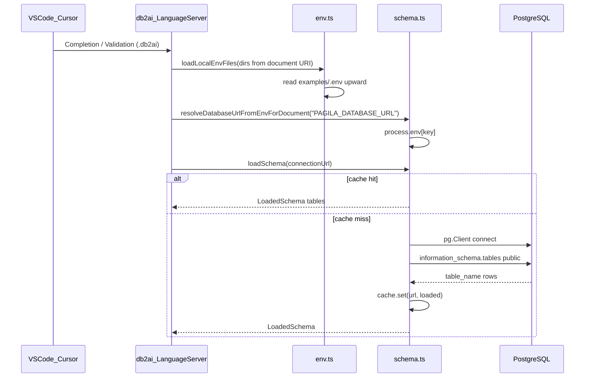

# Plan: SELECT mit Spalten + Schema erweitern

## Wie Schema-Ziehen heute funktioniert (Erklärung)



| Schicht          | Datei                                                                                                  | Rolle                                                                                                                                                                                        |
| ---------------- | ------------------------------------------------------------------------------------------------------ | -------------------------------------------------------------------------------------------------------------------------------------------------------------------------------------------- |
| **Env auflösen** | [`packages/language/src/env.ts`](db2ai/packages/language/src/env.ts)                                   | Liest `examples/.env` (und Elternordner) in `process.env`; [`workspaceDirsForDocumentUri`](db2ai/packages/language/src/env.ts) leitet aus `file://…/pagila.db2ai` den Ordner `examples/` ab. |
| **URL aus DSL**  | [`schema.ts`](db2ai/packages/language/src/schema.ts) `resolveDatabaseUrlFromEnvForDocument`            | DSL: `database env "PAGILA_DATABASE_URL"` → nur **Name** der Variable; Wert kommt aus `.env`, nie aus der `.db2ai`-Datei.                                                                    |
| **Schema laden** | [`schema.ts`](db2ai/packages/language/src/schema.ts) `loadSchema(url)`                                 | Einmal pro Connection-URL: `pg` → Query nur **`information_schema.tables`** (`public`, BASE TABLE) → `LoadedSchema = { tables: string[] }` → **In-Memory-Cache** (`Map`).                    |
| **Nutzung**      | [`db-2-ai-dsl-completion-provider.ts`](db2ai/packages/language/src/db-2-ai-dsl-completion-provider.ts) | Tabellen nach `FROM` (braucht URL + erreichbare DB).                                                                                                                                         |
|                  | [`db-2-ai-dsl-validator.ts`](db2ai/packages/language/src/db-2-ai-dsl-validator.ts)                     | Prüft, ob Tabelle existiert (nur wenn `{` im Block und Env gesetzt); DB-Fehler → **Warning**, kein harter Abbruch beim Generate.                                                             |
| **LSP-Hooks**    | [`packages/extension/src/language/main.ts`](db2ai/packages/extension/src/language/main.ts)             | `.env` bei Open/Change der Datei nachladen.                                                                                                                                                  |
| **CLI/MCP**      | [`packages/cli/src/env.ts`](db2ai/packages/cli/src/env.ts) (standalone, **ohne** Language-Import)      | Gleiche `.env`-Logik für `generate` / `mcp-serve`; MCP-Bundle darf Language nicht ziehen (esbuild).                                                                                          |
| **Runtime**      | [`packages/cli/src/generator.ts`](db2ai/packages/cli/src/generator.ts)                                 | Generiert fest `SELECT * FROM "table"` — **noch kein Schema** zur Laufzeit, nur DSL-Metadaten.                                                                                               |

**Wichtig:** Schema-Introspection läuft nur in **Language Server** (Validator/Completion), nicht im generierten MCP-Tool. MCP vertraut der validierten/generierten DSL.

**Aktuelle Lücke:** Es werden nur **Tabellennamen** geladen, keine Spalten — dafür ist Schritt 1 dieses Plans.

---

## Ziel (dieser Schritt)

- DSL: **`SELECT * FROM t`** oder **`SELECT col1, col2 FROM t`** (SQL-like, deine Wahl)
- Completion: Spalten aus Schema, sobald **Tabellenname in derselben Query** parsebar ist
- Validator: unbekannte Spalten → Error (wenn Block `{` da und DB erreichbar)
- Codegen: dynamisches `SELECT col1, col2` statt immer `*`
- **Nicht in diesem Schritt:** WHERE/Suche (nächster Schritt)

---

## 1. Schema erweitern

[`packages/language/src/schema.ts`](db2ai/packages/language/src/schema.ts):

```typescript
export type LoadedSchema = {
    tables: string[];
    columnsByTable: Record<string, string[]>;
};
```

- Zusätzliche Query (eine Connection, zwei Queries oder JOIN):

```sql
SELECT table_name, column_name
FROM information_schema.columns
WHERE table_schema = 'public'
ORDER BY table_name, ordinal_position;
```

- Hilfsfunktionen: `hasColumn(loaded, table, column)`, `columnsForTable(loaded, table)`
- Cache-Key bleibt Connection-URL (ein Objekt mit tables + columns)
- Tests: Mock in [`validating.test.ts`](db2ai/packages/language/test/validating.test.ts) / [`completions.test.ts`](db2ai/packages/language/test/completions.test.ts) um `columnsByTable` erweitern

---

## 2. Grammar + AST

[`packages/language/src/db-2-ai-dsl.langium`](db2ai/packages/language/src/db-2-ai-dsl.langium):

```langium
Query:
    'SELECT' selectList=SelectList 'FROM' table=TableName '{'
        ...
    '}';

SelectList:
    { '*' }
|   columns+=ColumnRef (',' columns+=ColumnRef)*;

ColumnRef:
    name=ID;
```

- AST: `SelectList` mit `all?: boolean` (oder dediziertes Union-AST nach Langium-Generate) + `columns: ColumnRef[]`
- `langium:generate` + Parser-Tests anpassen

---

## 3. Completion

[`db-2-ai-dsl-completion-provider.ts`](db2ai/packages/language/src/db-2-ai-dsl-completion-provider.ts):

- **Tabellen** (bestehend): nach `FROM`, wenn noch kein Tabellenname
- **Spalten** (neu): Cursor in `SelectList`-Region **und** `query.table.name` gesetzt
    - Nach `SELECT ` / nach Komma in Liste: Vorschläge aus `columnsForTable(loaded, table)`
    - Optional: Item `*` als erstes, wenn Liste leer / nur Teilersetzung von `*`
- `loadSchema` liefert dann `columnsByTable`

Erkennung SelectList-Region analog zu `findQueryForTableCompletion`: Offset zwischen `SELECT` und `FROM`, rechte Query gewinnt.

---

## 4. Validator

[`db-2-ai-dsl-validator.ts`](db2ai/packages/language/src/db-2-ai-dsl-validator.ts):

- Bei expliziter Spaltenliste: jede Spalte in `columnsByTable[table]`
- `SELECT *`: keine Spaltenprüfung
- Mindestens eine Spalte, wenn nicht `*`
- Duplikate in Liste → Error (wie duplicate keys im Block)

---

## 5. Codegen + Runtime

[`db-query-codegen.ts`](db2ai/packages/cli/src/db-query-codegen.ts) / [`generator.ts`](db2ai/packages/cli/src/generator.ts):

- `ResolvedDbToolCodegen`: `selectAll: boolean`, `columns: string[]`
- SQL:

```typescript
const selectClause = selectAll ? '*' : columns.map(quotePostgresIdent).join(', ');
const sql = `SELECT ${selectClause} FROM ${quotedTable} LIMIT $1 OFFSET $2`;
```

- [`pagila.db2ai`](db2ai/examples/pagila.db2ai): mindestens ein Beispiel mit expliziten Spalten (z. B. `film_id, title`)
- Tests + `npm run generate:pagila`

---

## 6. Doku

- [`examples/README.md`](db2ai/examples/README.md): kurz SELECT-Varianten + Hinweis Schema/`.env`
- Optional: Abschnitt in [`docs/architecture-sketches.md`](db2ai/docs/architecture-sketches.md) zu Schema-Cache

---

## Abgrenzung (nächster Schritt)

- **Suche / WHERE / Filter** — separates Feature; DSL-Design noch offen
- Kein freies SQL im MCP-Tool

---

## Umsetzungsreihenfolge

1. `schema.ts` + Tests (columns)
2. Grammar + Parser/Validator-Tests
3. Completion (columns + `*`)
4. Codegen + pagila-Beispiel + Smoke
5. `npm run langium:generate && npm run build`
