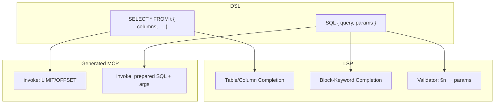

# Plan: Plain-SQL-Tools (`SQL { … }`)

## Dein Vorschlag — so verstanden

```db2ai
database env "PAGILA_DATABASE_URL"

SELECT * FROM category { … }   // Stufe 1: unverändert

SQL {
    toolName: "filmsByRating"
    intent: "films with minimum rating"
    summary: "Films filtered by rating"
    query: "SELECT film_id, title FROM film WHERE rating >= $1 LIMIT $2"
    params: {
        $1: "minimum rating (numeric)"
        $2: "max rows"
    }
}
```

| Element | Rolle |
|---------|--------|
| **`SQL { }`** | Eigenständiges Top-Level-Statement (parallel zu `SELECT * FROM`) |
| **`query`** | Normaler `STRING` mit `$1`, `$2`, … — **kein** SQL-Autocomplete |
| **`params`** | Map `$n` → **Agent-Doku**; wird MCP-`inputSchema` (Properties + descriptions) |
| Block-Keywords | `toolName`, `intent`, `summary`, `example`, `query`, `params` |

**Kein `exampleParams`** — weder in Grammar noch Validator noch Beispielen.



**Bezug:** Ersetzt [`db2ai_hybrid_sql`](api2ai/.cursor/plans/db2ai_hybrid_sql_d922a1c7.plan.md).

---

## 1. Grammar + AST

Datei: [`packages/language/src/db-2-ai-dsl.langium`](db2ai/packages/language/src/db-2-ai-dsl.langium)

```langium
SqlQuery:
    'SQL' '{'
        (
              'toolName' ':' toolName=STRING
            | 'intent' ':' intent=STRING
            | 'example' ':' example=STRING
            | 'summary' ':' summary=STRING
            | 'query' ':' query=STRING
            | 'params' ':' params=SqlParamMap
        )*
    '}';

SqlParamMap:
    '{' (entries += SqlParamEntry)* '}';

SqlParamEntry:
    placeholder=PARAM_REF ':' label=STRING;

terminal PARAM_REF: /\$[0-9]+/;
```

- `Model`: `(entries += ModelEntry)*` mit `TableQuery` | `SqlQuery`
- **`TableQuery`**: bisherige `Query`-Regel (SELECT + `columns`)
- `Query` → `TableQuery` in Language/CLI migrieren

**Pflichtfelder:** `toolName`, `intent`, `query`, `params` (wenn `$n` in `query` vorkommt)

---

## 2. Validierung (nur Parameter)

**Kein DB-Execute.** **Kein `exampleParams`.** **Keine** verbotenen SQL-Keywords in v1 (optional später).

Neu/erweitert: [`db-2-ai-dsl-sql-validator.ts`](db2ai/packages/language/src/db-2-ai-dsl-sql-validator.ts)

| Check | Schwere | Regel |
|-------|---------|--------|
| `$n` in `query` | error | Jedes per Regex gefundene `$n` (z. B. `$1`…`$9`) hat Eintrag in `params.entries` |
| `params` ohne `$n` | error | Jeder `params`-Key, der nicht in `query` vorkommt → „unused param“ |
| Doppelte `$n` in `params` | error | wie bei `columns`-Map |
| `toolName` | error | global eindeutig (`TableQuery` + `SqlQuery`) |
| `toolName` / `intent` | error | Pflicht (wie Table-Tools) |

Table-Tools: DB-Schema-Check für Tabellen/Spalten **unverändert**. SqlQuery: **kein** `loadSchema` / `pg`.

---

## 3. LSP: Completion

[`db-2-ai-dsl-completion-provider.ts`](db2ai/packages/language/src/db-2-ai-dsl-completion-provider.ts)

- **`query`**: keine Vorschläge
- **`SQL_BLOCK_KEYS`:** `toolName`, `intent`, `summary`, `example`, `query`, `params` (ohne `exampleParams`)
- **`params`:** optional Snippets `$1:` (Syntax-Hilfe, kein Schema)
- Table/Column-Completion nur in `TableQuery`

---

## 4. Codegen + Runtime

[`db-query-codegen.ts`](db2ai/packages/cli/src/db-query-codegen.ts)

- `ResolvedDbToolCodegen` mit `kind: 'table' | 'sql'`
- **SQL `inputSchema`:** Properties aus `params` (Mapping unten), **alle `type: string`** in v1
- **`buildDescription`:** `intent` + `summary` + Liste der Parameter (Label-Text aus `params`)

**Mapping `params` → MCP-Property-Namen:**

- Label ist gültiger Identifier (`customerId`) → Property `customerId`, `description` = Label-Text
- sonst → `param1`, `param2`, … (aus `$1`, `$2`), `description` = voller Label-String

[`generator.ts`](db2ai/packages/cli/src/generator.ts): SQL-Case `client.query({ text, values })` — `values` in Reihenfolge `$1`, `$2`, … aus `invokeTool`-Args (nach Property-Mapping).

[`mcp-server.ts`](db2ai/packages/cli/mcp-bundle/mcp-server.ts): `invokeTool(toolName, args: Record<string, unknown>)` — volles `args` durchreichen.

---

## 5. Tests & Beispiele

- **Parsing / Validating:** `$n`↔`params`, unused param, fehlendes `$2`
- **Smoke (mit DB):** SQL-Tool mit **CLI-JSON-Args** (z. B. `db2ai invoke filmsByRating '{"param1":"4.5","param2":"20"}'`) — erste echte SQL-Prüfung
- [`pagila.db2ai`](db2ai/examples/pagila.db2ai): ein `SQL { … }`-Beispiel
- [`examples/README.md`](db2ai/examples/README.md): `SELECT *` vs. `SQL`, nur `params`, Smoke-Args

---

## 6. Abgrenzung (v1)

| Nicht in v1 | |
|-------------|--|
| `exampleParams` | bewusst weggelassen |
| DB-Execute in LSP | |
| SQL-Autocomplete | |
| Verbotene SQL-Keywords | optional später |
| `columns` / `maxLimit` in SQL-Tools | |

---

## 7. Build

```bash
cd db2ai && npm run langium:generate && npm run build
```

Plan nach Freigabe: [`db2ai/.cursor/plans/db2ai_sql_tools.plan.md`](db2ai/.cursor/plans/db2ai_sql_tools.plan.md)

---

## Umsetzungsreihenfolge

1. Grammar + AST-Migration  
2. Sql-Validator (nur `$n` ↔ `params`)  
3. Completion  
4. Codegen + MCP  
5. Tests + pagila + README  
6. `langium:generate && build`
