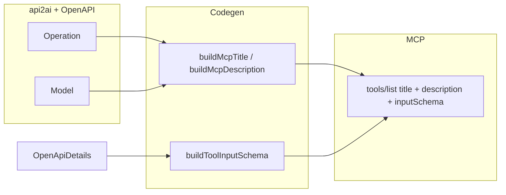

# Plan: Agent-taugliche MCP-Tools schärfen

## Einschätzungen (kurz)

| Thema                                   | Geteilte Sicht                                                                                                                                                                                                                                                                                                                                                                                                                                                                                                                                                                                                                                                                                                                                                                                                                                                                                                                                  |
| --------------------------------------- | ----------------------------------------------------------------------------------------------------------------------------------------------------------------------------------------------------------------------------------------------------------------------------------------------------------------------------------------------------------------------------------------------------------------------------------------------------------------------------------------------------------------------------------------------------------------------------------------------------------------------------------------------------------------------------------------------------------------------------------------------------------------------------------------------------------------------------------------------------------------------------------------------------------------------------------------------- |
| **1 Titel**                             | Ja: [`title`](packages/language/src/api-2-ai-dsl.langium) und [`buildMcpTitle`](packages/cli/src/openapi-tool-codegen.ts) sind bereits verdrahtet. Kuratierte `.api2ai`-Dateien können pro Tool **`title:`** setzen, wo OpenAPI-Summaries zu generisch sind (z. B. TMDB). Optional: Fallback im Generator verbessern (z. B. `operationId` bevorzugen wenn `summary` fehlt/leer) — **ohne** neue DSL-Syntax.                                                                                                                                                                                                                                                                                                                                                                                                                                                                                                                                     |
| **2 Parameter-Beschreibungen**          | Ja: muss **beim Generieren** passieren. [`OpenApiParameterDetails`](packages/language/src/openapi.ts) hat `description`, aber [`buildToolInputSchema`](packages/cli/src/openapi-tool-codegen.ts) projiziert nur `p.schema` via `openApiSchemaToJsonSchema` — die **Param-Beschreibung landet nicht** auf den Property-Schemas. **Änderung:** Beim Aufbau der `path`/`query`/`header`-Property-Einträge die jeweilige Parameter-`description` (falls gesetzt) in das JSON-Schema-Objekt mergen (z. B. nach Typ-Konvertierung; bei Konflikt Param-Description bevorzugen oder mit Schema-Description kombinieren).                                                                                                                                                                                                                                                                                                                                |
| **3 Response-Auszug**                   | Zustimmung: für Wurf 1 **kein** manuelles „Response beschreiben“ in der DSL; [`includeResponses`](packages/language/src/api-2-ai-dsl.langium) + OpenAPI-Extrakt reichen als PoC.                                                                                                                                                                                                                                                                                                                                                                                                                                                                                                                                                                                                                                                                                                                                                                |
| **4 Auth / muss der Agent das wissen?** | **Für funktionierende Aufrufe: nein.** `invokeTool` injiziert das Api-Key-/Bearer-Setup aus `authConfig` und `process.env[…]`; das **inputSchema** enthält zu Recht **keine** Credential-Felder — der Agent soll auch **kein** Token übergeben. Wenn die Umgebung korrekt konfiguriert ist, „funktioniert es“ ohne jede Auth-Erwähnung in `tools/list`. **Optionaler** einzeiliger Hinweis in der generierten Beschreibung (nur Env-**Name** + Header/Query-Ort, nie das Secret) hilft bei: fehlender Env-Variable (klarere Diagnose), Deployment-Dokumentation, schema-only-Tests die erklären sollen _warum_ 401 entstehen. **Kein Ersatz** für README ist nötig; README bleibt für Menschen/Setup parallel möglich.                                                                                                                                                                                                                          |
| **4b HTTP-Fehler (401 / 403 / 429)**    | **Ja, das hilft dem Agenten.** Wenn `fetch` mit Fehlerstatus endet, liefert der generierte Code heute nur einen kurzen String (`HTTP N while invoking …`). **Besser:** in der **Fehlermeldung** (nicht in `tools/list`) kurz kontextualisieren: **401** — z. B. Hinweis auf fehlendes/falsches Credential und **namentlich** `authConfig.env`, falls `model.auth` gesetzt (ohne Secret). **403** — keine Berechtigung / falscher Kontext. **429** — Rate Limit; optional **`Retry-After`** aus Response-Header auslesen und in den Text setzen; den Agenten so davon abhalten, sofort aggressiv zu retrien. Kein eingebautes automatisches Retry im Generator nötig; Ziel ist **klarer Tool-Output**, nicht neue DSL. Body der API bei Fehler optional gekürzt anhängen (wenn klein), damit Debugging einfacher wird.                                                                                                                           |
| **5 Nicht implementiert / irreführend** | Zustimmung: komplexe Specs nicht vortäuschen. Bereits vorhanden: [`getUnsupportedSerializationMessages`](packages/language/src/openapi.ts) + **Fehler** im [Validator](packages/language/src/api-2-ai-dsl-validator.ts). **Ergänzen solltet ihr** für Lücken, die **still** sind: z. B. **Cookie-Parameter** werden in [`parametersByLocation`](packages/cli/src/openapi-tool-codegen.ts) gar nicht gesammelt — aus Sicht Agent/Schema **fehlen** sie komplett. Vorschlag: für jede referenzierte Operation prüfen, ob `parameters` Einträge mit `in === 'cookie'` haben → **Validator-Fehler** („cookie parameters not supported in generated invoke“). Analog optional: **Warnung oder Fehler**, wenn `requestBody` existiert aber nicht in den unterstützten JSON-Pfaden landet (falls ihr das noch nicht hart validiert). **Kein** neues DSL-Keyword nötig — die Einschränkung kommt aus der **OpenAPI-Analyse** der gewählten Operationen. |

## Konkrete Umsetzungsschritte

1. **Parameter-Descriptions im Schema** — In [openapi-tool-codegen.ts](packages/cli/src/openapi-tool-codegen.ts): Hilfsfunktion, die aus `OpenApiParameterDetails` ein Property-Schema baut: `openApiSchemaToJsonSchema(p.schema)` + setze/reichere `description` mit `p.description` an. Tests:\_assert in Language/CLI-Tests, dass ein Fixture-Param mit `description` im generierten JSON vorkommt (optional Snapshot auf minimale Spec).

2. **Auth-Zeile in der Beschreibung (optional)** — Nur wenn ihr Diagnose/Operator-Setup verbessern wollt: [`buildMcpDescription`](packages/cli/src/openapi-tool-codegen.ts) um kurze **Context**-Zeile ergänzen; [generator `resolveToolsFromLoaded`](packages/cli/src/generator.ts) übergibt `model.auth`. Kein Geheimnis im Output, nur **Env-Variablenname** und Mechanismus. **Nicht** nötig, damit Auth „funktioniert“ — das erledigt die Runtime.

3. **Titel-Qualität ohne neue Syntax** — In kuratierten Dateien wie [examples/tmdb.api2ai](examples/tmdb.api2ai) pro Block **`title:`** ergänzen (deutsch/englisch nach eurem Stil). Optional danach: kleine Anpassung `buildMcpTitle` (z. B. wenn `details.summary` sehr kurz/ambig, `operationId` bevorzugen) — nur wenn ihr automatisch bessere Defaults wollt.

4. **Validator verschärfen (Cookie + ggf. weitere stille Lücken)** — In [openapi.ts](packages/language/src/openapi.ts) neue Hilfsfunktion ähnlich `getUnsupportedSerializationMessages` (oder Erweiterung davon): Meldung wenn Cookie-Parameter vorhanden. Im [Validator](packages/language/src/api-2-ai-dsl-validator.ts) dieselbe Schleife wie heute. Tests in [validating.test.ts](packages/language/test/validating.test.ts) mit Mini-OpenAPI-Fixture.

5. **HTTP-Fehler für Agenten lesbar** — Im generierten `invokeTool`-String ([`createSharedInvokeBlock`](packages/cli/src/generator.ts)): statt nur `throw new Error('HTTP ' + status + …)` nach `!response.ok` eine Hilfsfunktion inline erzeugen, die `status` verzweigt: **401** (mit Hinweis auf `authConfig`/`env`, wenn definiert), **403**, **429** (+ `response.headers.get('retry-after')` wenn vorhanden). Kein Secret im Text; optional ersten Teil von `response.text()` bei kleinem Body. Danach Tests/Beispiele regenerieren.

6. **Build** — Nach Änderungen außerhalb `examples/`: `npm run langium:generate && npm run build` (Workspace-Regel). Beispiele `examples/generated/*` bei Bedarf neu generieren.

## Abgrenzung (wie gewünscht)

- Keine neue DSL für manuelle Response-Beschreibung in diesem Schritt.
- Keine vollständige OpenAPI-3.1-Logik ($ref-Auflösung, `oneOf`-Body usw.) — stattdessen **bestehende** „degraded schema“-Texte belassen, aber **Cookie** und Serialization-MVP weiter strikt per Validator absichern.
