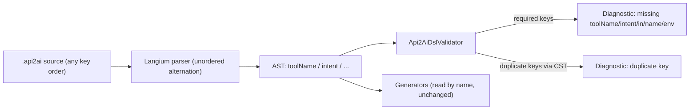

## Goal

Allow DSL authors to write the properties of `Operation` and `Auth` blocks in any order, following the idiomatic Langium / config-file pattern: parse as an unordered key/value bag, enforce constraints in the validator.

Why this approach:

- Aligns with how JSON, YAML, TOML, k8s manifests, `package.json`, idiomatic Langium DSLs handle blocks.
- AST property names stay the same, so generators that access `operation.toolName`, `model.auth.env`, etc. by name keep working semantically.
- Auto-completion via [`packages/language/src/api-2-ai-dsl-completion-provider.ts`](packages/language/src/api-2-ai-dsl-completion-provider.ts) + `DefaultCompletionProvider` naturally suggests any unset key at every position.

## Changes (as executed)

### 1. Grammar: [`packages/language/src/api-2-ai-dsl.langium`](packages/language/src/api-2-ai-dsl.langium)

`Operation` and `Auth` use an unordered alternation in a `( ... )*` loop. All assignments are syntactically optional; required-ness is enforced by the validator.

```langium
Auth:
    'auth' 'apiKey' '{'
        (
              'in' ':' location=AuthLocation
            | 'name' ':' name=STRING
            | 'env' ':' env=STRING
            | 'prefix' ':' prefix=STRING
        )*
    '}';

Operation:
    method=HttpMethod path=STRING '{'
        (
              'toolName' ':' toolName=STRING
            | 'intent' ':' intent=STRING
            | 'example' ':' example=STRING
            | 'summary' ':' summary=STRING
            | 'description' ':' description=STRING
        )*
    '}';
```

A repeated property would silently let the last value win in the AST; duplicate detection is done via the CST in the validator.

### 2. Validator: [`packages/language/src/api-2-ai-dsl-validator.ts`](packages/language/src/api-2-ai-dsl-validator.ts)

Three new check groups, dispatched from `checkModel`:

- **Required keys per `Operation`**: `toolName` and `intent` must be present and non-empty (separate diagnostics for "missing" vs. "empty"). `description: ""` stays valid by design.
- **Required keys per `Auth`** (when present): `in`, `name`, `env` must be present. Non-empty checks for `name` / `env` kept.
- **Duplicate keys per block**: `reportDuplicateKeywords` walks the block's `$cstNode` with `CstUtils.flattenCst` and `isLeafCstNode`, flags every occurrence after the first one as an error pointing at the duplicate keyword's range.

### 3. Codegen adapters

Because grammar changes made `toolName`/`intent` optionally typed, the codegen path (which runs only after validation) was adapted:

- [`packages/cli/src/generator.ts`](packages/cli/src/generator.ts): added `requireToolName(operation)` helper that throws with an informative message if codegen is invoked on an unvalidated model. Used in `resolveToolsFromLoaded`, `buildSchemasFromLoaded`, `buildQuerySerializationFromLoaded`.
- [`packages/cli/src/openapi-tool-codegen.ts`](packages/cli/src/openapi-tool-codegen.ts): `buildMcpTitle` and `buildMcpDescription` documented as "operation has passed validation"; minimal `!` assertions on `toolName` / `intent`.

### 4. Tests

- [`packages/language/test/parsing.test.ts`](packages/language/test/parsing.test.ts): 2 new positive parser tests for shuffled property order (Operation, Auth).
- [`packages/language/test/validating.test.ts`](packages/language/test/validating.test.ts): 6 new tests – missing `toolName`, missing `intent`, missing `in`/`name`/`env` in `auth apiKey`, duplicate `toolName` in operation, duplicate `env` in auth, and acceptance of a shuffled-order operation against an existing OpenAPI fixture.

### 5. README: [`README.md`](README.md)

Added one sentence under the DSL snippet documenting that properties inside `{ ... }` blocks may appear in any order, and listing required vs. optional keys for `Operation` and `auth apiKey`.

## Verification

- `npm run langium:generate && npm run build` → green.
- `npm test --workspaces --if-present` → 25 / 25 tests pass.
- Smoke: `npm run generate:tmdb-tools` runs without error (codegen path including `auth apiKey` and the new `requireToolName` guard exercised).

## Flow


