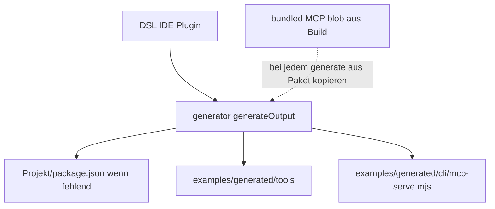

# Plan: `examples` = Laufzeit; Codegen = Plugin; Generator emittiert alles inkl. `mcp-serve.mjs`

## Rollenverteilung

| Ort | Zweck |
|-----|--------|
| **IDE‑Plugin / Extension** | **Codegenerierung** („Speichern“ / „Generate“ / Commands): ruft Diesel/Language + **`generateOutput`** auf; schreibt **`generated/tools/*`** und **`generated/cli/mcp-serve.mjs`**. |
| **Nutzerprojekt / `examples`** | Enthält **DSL + OpenAPI + `generated/`**; **`package.json`** entsteht beim **ersten Generate**, sobald keine existiert (**niemals** bestehende überschreiben); danach dort **`npm install`** für MCP‑Runtime‑Deps (**keine** Pflicht‑`generate`‑Scripts in dieser Datei). |
| **Monorepo Root** (`package.json`) | **Optional** Maintainer‑Shortcuts (`generate:*`), CI — nicht Teil des „Nutzer öffnet nur examples“‑Produkts. |

**Woher `package.json`?** Ohne Monorepo hat der Nutzer sie initial nicht. **Sinnvoll:** Beim **ersten** erfolgreichen Generate legt der Generator (oder das Plugin, das ihn aufruft) eine **Standard‑`package.json`** an — **nur wenn** im gewählten **Projektroot** noch **keine** liegt. **Spätere Generate‑Läufe** lassen eine vorhandene `package.json` **unverändert** (keine stillen Überraschungen, keine gelöschten Scripts). Nach dem ersten Gen: Hinweis im Plugin („`npm install` ausführen“). **Automatisches Nachziehen von Deps** in bestehende `package.json` bleibt **außerhalb MVP** (aktuell nur **Warn‑Hinweis** bei fehlenden Paketen).

## Ziel gleichermaßen

- Nach einem **Generate‑Vorgang (Plugin oder Maintainer‑CLI)** existieren **`generated/tools/*.mjs`** und **`generated/cli/mcp-serve.mjs`**.
- **`mcp-serve.mjs`** Kommt weiterhin aus **einmal gebündeltem Artefikat** beim Build der Generator‑Komponente; **`generate`** **kopiert** es mit — **nicht** manuell durch den Nutzer in `examples`.

## Warum ging „nur `examples`“ ohne Monorepo bisher nicht — und was sich ändert

- **Generate** brauchte **Language + CLI** aus dem Repo. Das liegt künftig **hinter der Extension** oder einem **öffentlichen Paket**, das die Extension einbindet — **nicht** in **`examples/package.json`**.
- **„Nur examples“ ohne Rest‑Repo:** Nutzerinnen installieren **`npm install` in `examples`** nur für **`node`/MCP**; **vorher** muss **`generated/`** bereits existieren (einmal durch **Plugin‑Generate**, oder Artefakte mitgeliefert / aus Repo gezogen). Das kann im Plan explizit so bleiben.

## Architektur (überarbeitet)



## Bootstrap `package.json` (Plugin‑Nutzer)

- **Welcher „Root"?** Vereinbarung im Plugin: z. B. Workspace‑Folder, der die **`.api2ai`** enthält (oder übergeordneter Projektroot — **ein** klares Mapping dokumentieren).
- **Regel:** `if (!existsSync(join(projectRoot, 'package.json')))` → **minimalen Inhalt schreiben** (`name`, `private`, `"type":"module"`, `dependencies`: `@modelcontextprotocol/sdk`, `zod` mit Versionen konsistent zur emittierten `mcp-serve.mjs`-Erwartung).
- **`else`** → Datei **nicht** öffnen/überschreiben. Fehlen **`@modelcontextprotocol/sdk`** / **`zod`**: **vorerst nur Hinweis** im Plugin (Warnung / kurze Anleitung), **kein** automatisches Merge von `dependencies`.
- **Monorepo:** Liegt bereits eine **`package.json` am Repo‑Root** und der Nutzer arbeitet in **`examples/`** ohne eigene Datei → entweder **kein** automatisches zweites `examples/package.json` (nur wenn wirklich **keine** vorhanden) **oder** bewusst nur **`examples`** als Root wenn Workspace nur diese öffnet — hier **„kein Überschreiben“** wichtiger als automatisches Anlegen an falscher Tiefe.

## Inhalt Minimal‑`package.json` (nach erstem Generate)

```text
dependencies: @modelcontextprotocol/sdk, zod
Keine generate-scripts nötig; optional später Komfort-scripts nur MCP-Start.
```

## Monorepo

- **`npm run generate:…`** im **Repo‑Root** bleiben als **Maintainer**/CI‑Werkzeug erlaubt.
- Dokumentieren: **Endnutzer‑Story** ist **Plugin**, nicht **`examples`-Scripts**.

## Validierung

- **Frisches Verzeichnis** ohne `package.json` → ein Generate‑Lauf erzeugt **sowohl** `generated/**` **als auch** **`package.json`**, dann `npm install` → MCP lauffähig.
- Ordner mit **bestehendem** `package.json` nach Generate → **bytegleich**/unberührt bezüglich `package.json` (bis auf manuelle Änderungen des Nutzers).
