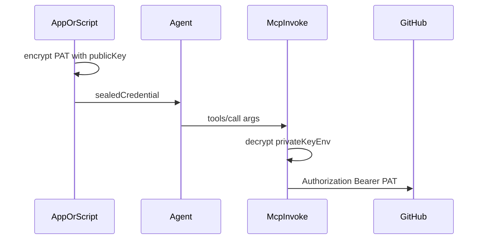

# Plan: GitHub-Anbindung mit optional versiegeltem User-Token (DSL + Generator)

## Zielbild

- **GitHub** als **Referenz-API** für ein **User-gebundenes** Secret (Classic oder fine-grained **PAT**), typisch `Authorization: Bearer <token>`.
- Zusätzlich zum heutigen Modell (**Klartext aus Env**) soll die DSL **`env` oder versiegelten Credential-Pfad** unterstützen: pro `tools/call` kommt **`sealedCredential`** (mit **Public Key** erzeugter Ciphertext) als **Tool-Argument**; der **generierte MCP-Code** (`invokeTool`) **entschlüsselt** mit **Private Key** aus Env und setzt **denselben** Header/Query wie im Env-Fall.
- **Agent:** bekommt nur Ciphertext + Anweisung durchzureichen (kein Klartext-PAT im Prompt nötig).

## DSL-Design: ein `auth`-Statement, zwei Modi (Empfehlung)

**Frage aus der Anforderung:** Block nicht mehr `apiKey` nennen — **ein eigener Block für sealed**?

**Empfehlung:** Unter **`auth`** zwei **Alternativen** (Langium `|`), statt eines Blocks mit optionalem `env` **und** optionalem `privateKeyEnv` (das wäre validator-lastig und leicht fehlbesetzt):

| Modus       | Keyword (Vorschlag)  | Pflichtfelder                                    | Secret-Quelle                                        |
| ----------- | -------------------- | ------------------------------------------------ | ---------------------------------------------------- |
| Env (heute) | z. B. `bearerEnv`    | `in`, `name`, `env`                              | `process.env[env]` + optional `prefix`               |
| Sealed      | z. B. `bearerSealed` | `in`, `name`, `privateKeyEnv`, optional `prefix` | Klartext aus `options.sealedCredential` nach Decrypt |

- **`apiKey`** entfällt zugunsten **`bearerEnv`** / **`bearerSealed`** (**Breaking change**, PoC ohne Alias).
- **`sealedCredential`** bleibt der **Tool-Parameter-Name** (wie im Archiv [obsolete/mcp-sealed-token-auth.md](../obsolete/mcp-sealed-token-auth.md)); nicht mit DSL-Blocknamen verwechseln.

Validator:

- Pro Block dieselbe Logik wie heute für **fehlende/duplizierte Keys** (CST-Dedupe existiert).
- **Exklusivität:** Entweder Env-Modus oder Sealed-Modus — durch Grammatik-Alternative bereits sicher; falls ein Modus intern optionale Felder hat, `env` vs `privateKeyEnv` nie beide setzbar.

## Technik: Krypto (MVP)

- **Gewählt (Seal-Hilfe, Wire `A2S1`):** **RSA-2048 OAEP SHA-256** umschließt einen zufälligen **AES-256-GCM**-Schlüssel; Payload = UTF-8 PAT. Exakte Bytefolge: [examples/scripts/seal-bearer-wire-format.md](../../examples/scripts/seal-bearer-wire-format.md).
- **Klartext nach Decrypt:** ein String = **roher GitHub-Token** (ohne Literal `Bearer`); Header-Wert = `(prefix ?? '') + plaintext` (Standard: `prefix: "Bearer "`).
- **Entschlüsseln im generierten Tool (`invokeTool`):** umgesetzt in [packages/cli/src/generator.ts](../../packages/cli/src/generator.ts) (`unsealA2S1`), byte-kompatibel mit [examples/scripts/seal-bearer-helper.mjs](../../examples/scripts/seal-bearer-helper.mjs) (RSA-OAEP SHA-256, AES-256-GCM, Wire `A2S1`).

## Seal-Hilfe und Schlüsselpaar (vorhanden)

- Skript: [examples/scripts/seal-bearer-helper.mjs](../../examples/scripts/seal-bearer-helper.mjs) — Befehle `gen-keypair`, `seal`, `verify` (Letzteres nur für lokale Roundtrip-Prüfung).
- Keys nach `examples/seal-keys/` schreiben; `*.pem` ist in [.gitignore](../../.gitignore) ausgeschlossen — siehe [examples/seal-keys/README.md](../../examples/seal-keys/README.md).

## OpenAPI: voll vs. minimal

- **Offizielles Gesamt-Bundle:** [github/rest-api-description](https://github.com/github/rest-api-description) → `descriptions/api.github.com/api.github.com.json` (sehr groß, nicht ins Repo committen).
- **Für api2ai-Demos:** kleine Repo-Datei [examples/openapi/github-user-min.openapi.yaml](../../examples/openapi/github-user-min.openapi.yaml) mit zwei **lesenden** Endpunkten:
    - **`GET /user`** — minimaler Smoke mit PAT (`read:user` o. Ä.); 401 bei fehlendem/falschem Token.
    - **`GET /repos/{owner}/{repo}`** — zeigt **Zugriff vs. kein Zugriff** ohne zweiten GitHub-Account: ein **privates** Repo, auf das der PAT **keine** Rechte hat, liefert typischerweise **404** (GitHub verschleiert Existenz); derselbe PAT auf ein **öffentliches** oder explizit freigegebenes Repo → **200**. Zwei echte **User** sind dafür nicht nötig; optional zweiter PAT mit **minimalen** Scopes vs. PAT mit **Repo-Zugriff**, um dasselbe zu verstärken.

## Code-Ort (Repo)

- Grammatik: [packages/language/src/api-2-ai-dsl.langium](../../packages/language/src/api-2-ai-dsl.langium)
- Validator / Duplikate: [packages/language/src/api-2-ai-dsl-validator.ts](../../packages/language/src/api-2-ai-dsl-validator.ts)
- Beschreibungstext MCP: [packages/cli/src/openapi-tool-codegen.ts](../../packages/cli/src/openapi-tool-codegen.ts) (Hinweis Env vs sealed statt nur env)
- Generator / `invokeTool` / `renderAuthConfig`: [packages/cli/src/generator.ts](../../packages/cli/src/generator.ts)
- JSON-Schema / Zod-Embed für `InvokeOptions`: gleiche Datei / eingebettete Generierung
- MCP-Bundle: [packages/cli/mcp-bundle/mcp-server.ts](../../packages/cli/mcp-bundle/mcp-server.ts) nur falls Schema-Union angepasst werden muss (meist nur generiertes Modul)
- Completion: [packages/language/src/api-2-ai-dsl-completion-provider.ts](../../packages/language/src/api-2-ai-dsl-completion-provider.ts) an neue Auth-Keywords anpassen

## GitHub-Beispiel (Deliverable)

- **OpenAPI:** minimal [examples/openapi/github-user-min.openapi.yaml](../../examples/openapi/github-user-min.openapi.yaml); bei Bedarf lokal gegen das offizielle Bundle referenzieren (Download per `curl`, nicht versionieren).
- **`examples/github.api2ai`:** `baseUrl` GitHub API, `auth bearerSealed { … }`, eine Operation **`GET /repos/{owner}/{repo}`**; optional später zweites Beispiel-File mit `bearerEnv`.
- **`npm run generate:github-tools`** (oder bestehendes Generate-Pattern aus [package.json](../../package.json)) ergänzen.
- **Dokumentation:** PAT nur in Env oder versiegelt; nie ins Repo committen.

## Abgrenzung / Nicht-Ziele (dieser Plan)

- **Kein OAuth-Web-Flow** im MCP (bleibt bei eurer App-Architektur).
- **Keine** dynamische `tools/list`-Filterung nach User-Rechten (siehe [api-boundary-tool-permissions.plan.md](../api-boundary-tool-permissions.plan.md)).
- **Kein** `requiresPermissions` an der DSL — kann später kommen.

## Abhängigkeit

- Überlappt inhaltlich mit [obsolete/mcp-sealed-token-auth.md](../obsolete/mcp-sealed-token-auth.md); dieser Plan **bindet** das Konzept an **GitHub + DSL-Namensgebung + Env-vs-Sealed-Entscheid** und ersetzt den Archiv-Plan inhaltlich.

## Verifikation

- `npm run langium:generate && npm run build` — grün
- `npm test` (packages/language) — grün
- `npm run generate:github-tools` (und andere `generate:*`) — erzeugt u. a. [examples/generated/tools/github-tools.ts](../../examples/generated/tools/github-tools.ts) mit `sealedCredential` im Schema und `unsealA2S1` im Invoke
- Manueller Smoke: Keypair → `seal-bearer-helper.mjs seal --public-key … --pat …` (oder `--stdin`) → `API2AI_SEAL_PRIVATE_KEY` setzen → `invokeTool` mit `pathParams` + `sealedCredential` gegen echtes Repo
