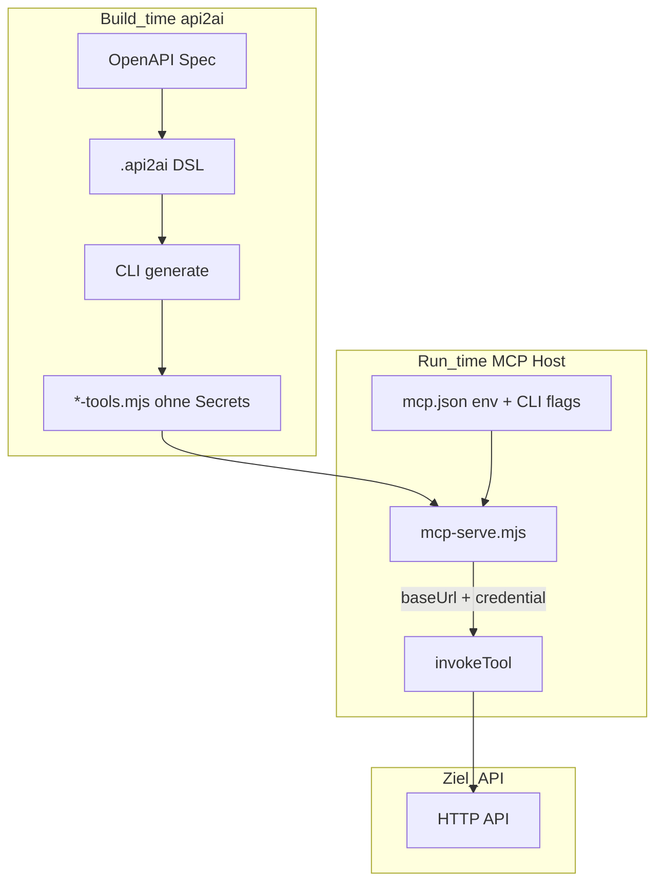

# Plan: Host-Runtime-Config (Option B) — Demo statt PoC

## Zielbild (Produkt)



- **DSL/Generator (Lizenz/Produktkern):** Welche OpenAPI-Operationen werden Tools, Intent, Schemas, **wie** Auth an die API geht (`in`, `name`, `prefix`) — **nicht** wo Secrets/Base-URL liegen.
- **MCP-Host (Demo + später kommerzielle Runtime):** Liest konfigurierte Env-Variablen, injiziert `baseUrl` + `credential` pro `tools/call`. Heute stdio; HTTP/OAuth bleibt [archiviert](../obsolete/dsl-http-oauth-passthrough.plan.md).

Entscheidungen (von dir):

- **`bearerSealed` komplett entfernen** (Breaking).
- **`baseUrl` nur Host** — kein Literal mehr in `.api2ai`.

---

## 1. DSL-Änderungen ([`api-2-ai-dsl.langium`](../../packages/language/src/api-2-ai-dsl.langium))

**Vorher:**

```txt
baseUrl "https://api.themoviedb.org"
auth bearerEnv { in: header name: "Authorization" env: "TMDB_ACCESS_TOKEN" prefix: "Bearer " }
```

**Nachher:**

```txt
openapi "./openapi/tmdb.openapi.json"

auth {
    in: header
    name: "Authorization"
    prefix: "Bearer "
}

GET "/3/search/movie" { ... }
```

| Änderung | Detail |
|----------|--------|
| `baseUrl` entfernen | Aus `entry Model`; kein Fallback im Generator |
| `Auth` vereinheitlichen | Ein Block `auth { … }` (kein `bearerEnv` / `bearerSealed`) |
| Pflichtfelder `auth` | `in`, `name`; optional `prefix` (wie heute) |
| `insecureEnv` | Unverändert optional auf Model-Ebene |

Validator ([`api-2-ai-dsl-validator.ts`](../../packages/language/src/api-2-ai-dsl-validator.ts)): Regeln für `bearerEnv`/`bearerSealed` löschen; Duplikat-Keys für neues `Auth`-Layout; Tests in [`validating.test.ts`](../../packages/language/test/validating.test.ts) anpassen.

Completion ([`api-2-ai-dsl-completion-provider.ts`](../../packages/language/src/api-2-ai-dsl-completion-provider.ts)): Keywords `bearerEnv`/`bearerSealed` entfernen.

Export aus Language-Package: Type Guards `isBearerEnvAuth` etc. entfernen/ersetzen durch `isAuth` (generiertes AST).

---

## 2. MCP-Host CLI (Option B-Kern)

Erweiterung [`mcp-standalone-entry.ts`](../../packages/cli/mcp-bundle/mcp-standalone-entry.ts) + [`mcp-server.ts`](../../packages/cli/mcp-bundle/mcp-server.ts):

```text
node mcp-serve.mjs <tools.mjs> \
  --base-url-env TMDB_BASE_URL \
  [--auth-env TMDB_ACCESS_TOKEN]
```

| Flag | Pflicht | Verhalten |
|------|---------|-----------|
| `--base-url-env` | **ja** (immer) | `process.env[name]` → `invokeTool({ baseUrl })`; fehlt/leer → klarer Fehler beim Tool-Call |
| `--auth-env` | wenn DSL `auth` hat | Env-Wert = rohes Secret; Generator setzt `prefix` + Header |
| (kein Flag) | DSL ohne `auth` | Kein Auth-Header (spaceflight, open-meteo) |

Parsing: minimal (kein Commander nötig) — `process.argv` oder kleines Hilfsmodul in `mcp-bundle/parse-host-args.ts`.

Beim Start (optional): Log-Zeile `[mcp] baseUrlEnv=… authEnv=…` **ohne** Werte.

Tool-Handler in [`mcp-server.ts`](../../packages/cli/mcp-bundle/mcp-server.ts):

```ts
const baseUrl = process.env[hostConfig.baseUrlEnv];
const credential = hostConfig.authEnv ? process.env[hostConfig.authEnv] : undefined;
await invokeTool(name, { baseUrl, credential, pathParams, query, headers, body });
```

- `sealedCredential` aus Zod-Schema und `GeneratedInvokeOptions` **entfernen**.
- Generiertes Modul exportiert `authConfig` (nur `location`, `name`, `prefix`) — Host prüft: `authConfig` gesetzt ⇒ `--auth-env` Pflicht.

---

## 3. Generator ([`generator.ts`](../../packages/cli/src/generator.ts))

| Thema | Änderung |
|-------|----------|
| `export const baseUrl = "…"` | **Entfällt** |
| `authKind` / `bearerSealed` / RSA-A2S1 | **Entfernen** (inkl. Crypto-Imports im generierten Code) |
| `resolveAuthSecret` | Liest `options.credential` (vom Host); wirft wenn `authConfig` und credential fehlt |
| `InvokeOptions` | `baseUrl` **required** vom Host; `credential?: string`; kein `sealedCredential` |
| `inputSchema` | Nie Credential-Felder |
| Tool-Beschreibung ([`openapi-tool-codegen.ts`](../../packages/cli/src/openapi-tool-codegen.ts)) | Runtime-Hinweis: „Configure `--base-url-env` / `--auth-env` on the MCP host (see mcp.json)“ — **keine** Env-Namen aus DSL |

`effectiveBaseUrl = options.baseUrl` (kein Modul-Default).

---

## 4. Entfernen: Sealing & GitHub-Seal-Demo

| Entfernen / bereinigen |
|------------------------|
| `examples/scripts/seal-bearer-helper.mjs`, Wire-Format-Doc, `npm run seal:*` |
| `examples/seal-keys/`, gitignore-Einträge für `*-sealed-token.txt` (optional behalten für lokale Altlasten) |
| [`examples/github.api2ai`](../../examples/github.api2ai) → auf `auth { … }` + Host-Env umstellen (PAT in `GITHUB_TOKEN` o.ä.) |
| README-Abschnitte zu A2S1 / `sealedCredential` |
| [`.cursor/rules`](../../examples/.cursor/rules) — Regeln zu `sealedCredential` / Token-Dateien |
| Plan [`github-sealed-bearer.plan.md`](github-sealed-bearer.plan.md) — Hinweis „superseded by host-runtime-config“ (kein Löschen nötig) |

---

## 5. Examples & Demo-Config

Alle [`examples/*.api2ai`](../../examples/):

- `baseUrl`-Zeile entfernen
- `auth bearerEnv` / `bearerSealed` → `auth { … }` (nur tmdb, github; open-meteo/spaceflight ohne auth)

[`examples/.cursor/mcp.json.example`](../../examples/.cursor/mcp.json.example) — **Demo-tauglich** mit `env` + CLI-Args pro Server.

[`examples/README.md`](../../examples/README.md) + Root [`README.md`](../../README.md):

- Abschnitt **„Demo & commercial boundary“**: Build (api2ai) vs. Run (MCP host config); Beratung/Lizenz = gehosteter oder angepasster Host, nicht stdio in Produktion.
- Getting Started: `.env.local` / `mcp.json` `env` — Secrets **nie** im Chat.

---

## 6. Smoke & Extension

- [`smoke.ts`](../../packages/cli/src/smoke.ts): `invokeTool` mit `baseUrl` + `credential` aus Env (Flags oder feste Test-Env); `test:smoke:tmdb` Doku anpassen.
- Extension generate-on-save: unverändert; nur neu generierte Artefakte.
- `npm run generate:*` für alle Examples; MCP-Refresh.

---

## 7. Verifikation

1. `npm run langium:generate && npm run build`
2. `npm test` (language)
3. `npm run generate:*` (alle Examples)
4. `npm run test:smoke` / `test:smoke:tmdb` mit gesetzten Env-Vars
5. Manuell: Workspace `examples`, TMDB-Tool ohne `sealedCredential`, Token nur in `mcp.json` `env`

---

## 8. Implementierungsreihenfolge

1. Grammatik + Validator + Tests (Breaking AST)
2. Generator + openapi-tool-codegen (ohne Seal/baseUrl export)
3. MCP-Host CLI + Injection
4. Examples + `mcp.json.example` + README
5. Sealing-Artefakte entfernen + cursor rules
6. Regenerate all `examples/generated/**`

---

## 9. Nicht in diesem Plan

- HTTP-MCP, OAuth, `bearerPassthrough` (bleibt obsolete)
- Automatisches Lesen von `auth-env` aus `mcp.json` ohne CLI-Args (Cursor unterstützt keine Host-Metadaten außer `env` — **Args + env** ist der pragmatische Weg)
- Kommerzielles Hosting-Produkt (nur architektonische Vorbereitung durch Host-Injection)

---

## 10. Breaking Changes (für Demo-Kommunikation)

- Bestehende `.api2ai` mit `baseUrl` / `bearerEnv` / `bearerSealed` sind **inkompatibel** — Migration: `baseUrl`/`env` nach `mcp.json`, `auth` vereinheitlichen.
- GitHub-Demo: PAT in Env statt Seal.

**Status:** Umsetzung abgeschlossen (Mai 2026). Plan nach `done/` verschoben.
