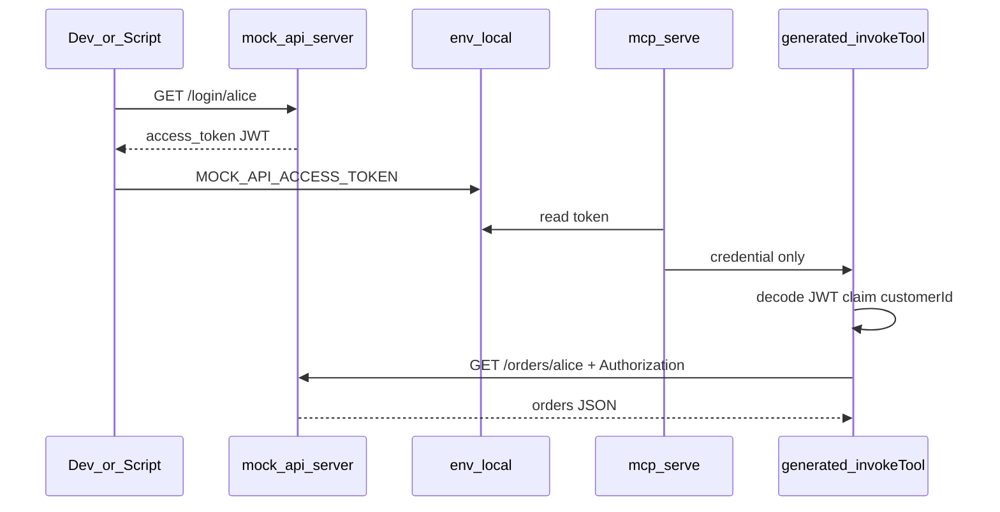

# Plan: JWT Demo auf `mock-api` + `fromJwt`

## Ziel

Demonstration des Kundenportal-Musters: **Bearer-JWT** enthält `customerId`; Tools wie „meine Bestellungen“ rufen `GET /orders/{customerId}` auf, **ohne** dass der Agent `customerId` oder das Token kennt.



**Login:** nur per curl/Script ([`examples/mock-api/get-token.mjs`](examples/mock-api/get-token.mjs)) — kein MCP-Login-Tool.

---

## Namenskonvention (erweiterbar)

| Artefakt          | Name                                         | Rolle                                                                                             |
| ----------------- | -------------------------------------------- | ------------------------------------------------------------------------------------------------- |
| Laufzeit / Ordner | **`examples/mock-api/`**                     | Eine lokale HTTP-API für alle künftigen Demo-Szenarien (Orders jetzt, später ggf. weitere Routes) |
| OpenAPI           | **`mock-api.openapi.yaml`**                  | Gemeinsame Spec; wächst mit neuen Endpoints                                                       |
| DSL pro Szenario  | **`jwt-orders.api2ai`** (v1)                 | Kuratierte Tools; weitere Dateien später z. B. `jwt-xyz.api2ai` gegen dieselbe `mock-api`         |
| Env-Präfix        | **`MOCK_API_*`**                             | `MOCK_API_BASE_URL`, `MOCK_API_ACCESS_TOKEN`, `MOCK_API_JWT_SECRET`                               |
| MCP-Server        | **`api2ai-mock-api-jwt-orders`**             | Ein Eintrag pro generiertem Tool-Modul (wie `api2ai-tmdb`)                                        |
| npm               | `demo:mock-api`, `generate:jwt-orders-tools` |                                                                                                   |

`mock-api` ist bewusst **allgemeiner** als `mock-orders` — der Orders-Fall ist nur das erste Szenario.

---

## 1. Mini-API ([`examples/mock-api/`](examples/mock-api/))

| Endpoint                   | Verhalten                                                                                                             |
| -------------------------- | --------------------------------------------------------------------------------------------------------------------- |
| `GET /login/{customerId}`  | Mintet HS256-JWT, Payload `{ customerId, iat, exp }`, Antwort `{ "access_token": "..." }`                             |
| `GET /orders/{customerId}` | Erfordert `Authorization: Bearer <jwt>`; prüft Signatur + Claim `customerId` === Pfad; liefert statische Bestellliste |

**Implementierung:** [`server.mjs`](examples/mock-api/server.mjs) (Node `http`, keine neuen Dependencies), Port **3847**.

- Secret: `MOCK_API_JWT_SECRET` (Default `demo-mock-api-secret`)
- Demo-Kunden `alice`, `bob` — [`data/orders.json`](examples/mock-api/data/orders.json)
- 401 / 403 wie zuvor

**Hilfen:**

- [`get-token.mjs`](examples/mock-api/get-token.mjs) — `node get-token.mjs alice` → Token → `.env.local` als `MOCK_API_ACCESS_TOKEN`
- [`README.md`](examples/mock-api/README.md)

**Script** in [`examples/package.json`](examples/package.json):

```json
"demo:mock-api": "node ./mock-api/server.mjs"
```

---

## 2. OpenAPI ([`examples/openapi/mock-api.openapi.yaml`](examples/openapi/mock-api.openapi.yaml))

- `servers: [{ url: http://127.0.0.1:3847 }]`
- Paths: `/login/{customerId}`, `/orders/{customerId}`
- Orders: `security: [{ bearerAuth: [] }]`
- Login: ohne security (nicht als Tool kuratiert)

---

## 3. DSL: `fromJwt`

**Grammatik** — [`packages/language/src/api-2-ai-dsl.langium`](packages/language/src/api-2-ai-dsl.langium): optionales `fromJwt: STRING` im `auth`-Block.

**Validator** — [`api-2-ai-dsl-validator.ts`](packages/language/src/api-2-ai-dsl-validator.ts):

- `AUTH_BLOCK_KEYS` + `fromJwt`
- `fromJwt` nur mit `auth`, nicht leer
- **Keine** Cross-Check-Warnung Pfadparameter ↔ Claim in v1

**Tests:** Parsing/Validating

---

## 4. Generator + Tool-Schema

**[`generator.ts`](packages/cli/src/generator.ts):** JWT-Payload decodieren, Claim in `pathParams` setzen, dann Auth-Header; `authConfig.fromJwt` exportieren.

**[`openapi-tool-codegen.ts`](packages/cli/src/openapi-tool-codegen.ts):** Pfadparameter mit Name === `fromJwt` aus MCP-`inputSchema` entfernen.

**MCP-Host:** `--auth-env MOCK_API_ACCESS_TOKEN` (unverändertes Modell).

---

## 5. Beispiel-DSL + Integration

**[`examples/jwt-orders.api2ai`](examples/jwt-orders.api2ai):**

```txt
openapi "./openapi/mock-api.openapi.yaml"

auth {
    in: header
    name: "Authorization"
    prefix: "Bearer "
    fromJwt: "customerId"
}

GET "/orders/{customerId}" {
    toolName: "listCustomerOrders"
    intent: "list orders for the authenticated customer"
    example: "List my orders"
    summary: "List customer orders"
}
```

**Root** [`package.json`](package.json): `generate:jwt-orders-tools` → `jwt-orders-tools.ts`

**[`examples/.cursor/mcp.json`](examples/.cursor/mcp.json):**

- Server `api2ai-mock-api-jwt-orders`
- `MOCK_API_BASE_URL` = `http://127.0.0.1:3847`
- `--auth-env MOCK_API_ACCESS_TOKEN` (Token nur `.env.local`)

**[`examples/README.md`](examples/README.md):** Abschnitt JWT/`fromJwt`-Demo

---

## 6. Verifikation

1. `npm run langium:generate && npm run build`
2. `npm test`
3. `cd examples && npm run demo:mock-api`
4. `node mock-api/get-token.mjs alice` → `.env.local`
5. `npm run generate:jwt-orders-tools`
6. MCP: `listCustomerOrders` ohne `customerId` im Schema

---

## Abgrenzung (v1)

- Kein `bindParam`, kein JWKS, keine Client-Signaturprüfung
- Kein MCP-Login-Tool
- Kein Validator-Warnung Pfadparameter/Claim
- Unabhängig von gitignored `customer-portal/`

## Dateien (Überblick)

| Neu/Geändert                                  | Inhalt                              |
| --------------------------------------------- | ----------------------------------- |
| `examples/mock-api/*`                         | Server, Daten, Script, README       |
| `examples/openapi/mock-api.openapi.yaml`      | Spec (gemeinsam für künftige Demos) |
| `examples/jwt-orders.api2ai`                  | Erstes Szenario + `fromJwt`         |
| `packages/language/...`, `packages/cli/...`   | fromJwt                             |
| `examples/.cursor/mcp.json`, READMEs, scripts | Draht                               |
