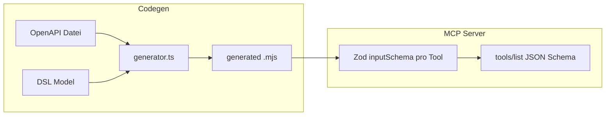

# OpenAPI-Metadaten in generierte MCP-Tool-Definitionen

## MCP: Standard-Format für Tools

Ja — das ist in der **Model Context Protocol**-Spezifikation festgelegt. Clients rufen **`tools/list`** auf; die Antwort enthält eine Liste von Tool-Objekten. Pro Tool sind u.a. relevant ([Draft-Doku auf GitHub](https://github.com/modelcontextprotocol/modelcontextprotocol/blob/main/docs/specification/draft/server/tools.mdx)):

| Feld              | Rolle                                                                                                    |
| ----------------- | -------------------------------------------------------------------------------------------------------- |
| `name`            | Eindeutiger Tool-Name (String)                                                                           |
| `title`           | Optional, kurzer Anzeigename                                                                             |
| `description`     | Optional, Freitext für das Modell                                                                        |
| **`inputSchema`** | **JSON Schema** (`type: "object"`, `properties`, `required`) — beschreibt die Argumente von `tools/call` |

Optional (je nach Spec-Version): `outputSchema`, `annotations`, `execution`, `_meta`, `icons`.

Der TypeScript-SDK (`McpServer.registerTool` in [node_modules/@modelcontextprotocol/sdk/dist/esm/server/mcp.d.ts](node_modules/@modelcontextprotocol/sdk/dist/esm/server/mcp.d.ts)) nimmt **`inputSchema` als Zod-Schema** entgegen und wandelt es für `tools/list` per `toJsonSchemaCompat` in **JSON Schema** um — das sichtbare Format für Hosts/LLMs bleibt damit das Standard-JSON-Schema aus der MCP-Spezifikation.

## Aktueller Stand im Repo (nach Umsetzung)

- OpenAPI wird geladen und zu **`OpenApiOperationDetails`** normalisiert ([packages/language/src/openapi.ts](../../../packages/language/src/openapi.ts)).
- **Generator** lädt OpenAPI pro Run, baut pro Tool **`title`**, zusammengesetzte MCP-**`description`** und **`inputSchemaByTool`** aus Spec + DSL-Overrides ([packages/cli/src/generator.ts](../../../packages/cli/src/generator.ts), [packages/cli/src/openapi-tool-codegen.ts](../../../packages/cli/src/openapi-tool-codegen.ts)).
- **`mcp-server.ts`** registriert pro Tool **`title`**, **`description`**, **`inputSchema`** aus dem generierten Modul (Zod via `jsonSchemaToZod`) ([packages/cli/src/mcp-server.ts](../../../packages/cli/src/mcp-server.ts)).

## Festgelegte Entscheidungen

- **DSL `includeResponses`:** Optionales **Schlüsselwort** allein auf einer Zeile (`includeResponses`); **fehlt** → kein `Response:`-Abschnitt. Kein `: true` / `: false` mehr.
- **Zod vs. JSON Schema (siehe unten „Schema-Pipeline“):** Canonical ist **JSON Schema im generierten Modul**; Zod nur als **dünne Laufzeit-Brücke** für das MCP SDK.
- **Welche Success-Response aus der OpenAPI-Liste (wenn `includeResponses` gesetzt):** Feste Priorität: **`200`** falls in `responses` vorhanden, **sonst `201`**, **sonst erste übrige `2xx`-Response**, die **`application/json`** (oder ersten verfügbaren Media-Type) mit Schema hat, **sonst** erste beliebige `2xx`. Keine 4xx/5xx in v1. _Hinweis:_ `204` hat oft keinen Body — dann reicht Status + `description` aus der Spec; kein Property-Summary.
- **Wie knapp das Response-Format aus dem Schema:** Typ **`object`** (oder primitiv/array wenn kein Object) **plus eine Zeile** mit **Property-Namen nur auf der ersten Ebene** (z. B. `properties: id, name, …` oder komma-separiert). **Keine** rekursive Auflösung verschachtelter Objekte in v1.
- **MCP `title`:** Kette (erster Treffer): **DSL-`title`** → **DSL-`summary`** → OpenAPI **`summary`** → **`operationId`**. Für Clients/UI kurzes Label; fürs Modell sekundär zu **`description`** / **`inputSchema`**. **Pflicht in v1:** `title` im **generierten Modul** pro Tool exportieren und in [packages/cli/src/mcp-server.ts](../../../packages/cli/src/mcp-server.ts) an **`registerTool(..., { title, description, inputSchema })`** durchreichen.
- **OpenAPI `description`:** In **`API:`**-Abschnitt der MCP-**`description`** (siehe Reihenfolge unten). **OpenAPI-Beispiele (`example` / `examples`):** In **OpenAPI 3** gibt es am **Operation-Objekt kein** zentrales Top-Level-**`example`** wie früher in Swagger 2 — Beispiele hängen typisch an **requestBody**, **parameters** oder **responses**. **Response-**`example` / **Response-**`examples` **nicht** in die Tool-Definition übernehmen (weder in `description` noch anderswo). **Request-Body-**Beispiel-JSON in v1 **ebenfalls nicht** in den MCP-Text: Ziel ist ein **Beispiel-Prompt** (siehe **`Example:`** unten), kein roher Payload aus der Spec.
- **DSL-Spiegel mit Override (Operationsebene, v1):** Optionale Felder **`title`**, **`summary`**, **`description`** (Grammatik-Namen in Umsetzung). **Regel:** Feld in der DSL **fehlt** (nicht angegeben) → Wert aus **OpenAPI** (wenn vorhanden). Feld ist **angegeben** → **DSL-Wert gilt**, **einschließlich leerer String `""`** — dann **kein** Fallback auf OpenAPI für dieses Feld (Abschnitt auslassen bzw. leer behandeln). **Nicht in v1:** Override-Logik für **einzelne Parameter** oder **Response-Bodies**; keine OpenAPI-Beispiel-Übernahme in **`Example:`**.
- **DSL `example` (bestehend, optional):** Eine Zeile **Beispiel-Prompt** / Nutzerfrage für den Agenten — **nur** aus der DSL, **kein** Merge mit OpenAPI-Request-JSON. Wenn nicht gesetzt → **`Example:`**-Abschnitt **weglassen**.
- **Bewertung:** Das ist eine **sinnvolle** Arbeitsteilung — wenig Redundanz, klare Defaults, gezielte Korrektur ohne die Grammatik mit vollständiger OpenAPI zu duplizieren.
- **Veraltete Pläne:** [../obsolete/](../obsolete/) nur Archiv; maßgeblich ist diese Datei.

## Ziel

1. Beim **`generate`**: dieselbe OpenAPI-Datei wie die Validator-Pipeline laden (`loadOpenApi(model.openapi, baseDir)` mit `baseDir = path.dirname(source)`).
2. Pro DSL-Operation: Lookup via `makeOperationLookupKey(method, path)` und daraus:
    - **MCP `title`:** Kette **DSL-`title` → DSL-`summary` → OpenAPI-`summary` → `operationId`** (s.o.).
    - **MCP `description`:** Zusammensetzen nach **fester Abschnittsreihenfolge** (siehe unten); Overrides für `description`/`summary`/`title` nach **fehlt vs. gesetzt (inkl. `""`)**-Regel.
    - **Response-Hinweis in der Tool-Beschreibung**: nur wenn das DSL-Schlagwort **`includeResponses`** gesetzt ist — Auswahl **200 → 201 → …** und **flaches** Schema-Summary s.o.
    - **`inputJsonSchema`**: äußeres Objekt wie heute (`pathParams`, `query`, `headers`, `body`), **pro Bucket** echte Property-Namen mit **`description`** und Typ aus `parameter.schema` bzw. Body-Schema — **`required`**-Arrays passend zu OpenAPI (`path` immer required im path-Bucket; query/header nach `required`).

### Aufbau MCP `description` (feste Reihenfolge)

Vor dem Zusammenfügen: **`title`** nach Kette **DSL-`title` → DSL-`summary` → OpenAPI-`summary` → `operationId`**. Für **`API:`** / **`Request body:`**-Texte: effektive **`description`** = DSL-Feld **fehlt** ? OpenAPI : DSL (inkl. `""` → kein OpenAPI-Fallback). **`Example:`** nur aus DSL-**`example`** (Prompt), siehe „Festgelegte Entscheidungen“.

**Abschnitte in dieser Reihenfolge** (nur ausgeben, wenn der Abschnitt nach Zusammenführung **nicht leer** ist; zwischen Abschnitten eine **Leerzeile**):

1. **`Intent:`** — DSL-**`intent`** (immer vorhanden, Pflichtfeld).
2. **`API:`** — effektive **Operations-`description`** (DSL-Override falls angegeben, sonst OpenAPI; bei DSL-`""` Abschnitt weglassen). OpenAPI-**`summary`** hier **nicht** wiederholen — steckt im MCP-**`title`**.
3. **`Meta:`** — eine kompakte Zeile mit **`tags`** (komma-separiert) und **`operationId`**, wenn mindestens eines vorhanden.
4. **`Request body:`** — nur OpenAPI **`requestBody.description`** (v1 kein DSL-Override dafür); nur Text, kein Schema-Dump.
5. **`Example:`** — nur wenn DSL-**`example`** gesetzt: **ein Beispiel-Prompt** (Nutzerfrage / wie der Agent das Tool nutzen soll), **kein** JSON-Payload aus OpenAPI. OpenAPI Request-/Response-**`example`** hier **nicht** verwenden.
6. **`Response:`** — nur wenn **`includeResponses`** in der DSL steht: Status nach 200/201/…-Regel, Response-**`description`** aus Spec, plus **eine Zeile** Top-Level-**properties** aus dem Schema (keine Rekursion).

**Stabilität:** Diese Überschriften (`Intent:`, `API:`, …) **fix** im Generator verwenden, damit sich der Text bei gleicher Spec nicht ändert.

### DSL-Erweiterungen

**1) `includeResponses`:** Optionales **Schlüsselwort** (Grammatik: `(includeResponses?='includeResponses')?` in [packages/language/src/api-2-ai-dsl.langium](../../../packages/language/src/api-2-ai-dsl.langium)). **Nicht** mehr `includeResponses: true` / `: false`. Codegen prüft `operation.includeResponses` (truthy).

**2) Operation-Block-Reihenfolge (Grammatik):** `toolName`, `intent`, optional `example`, `title`, `summary`, `description`, optional `includeResponses`.

**3) Operation-Overrides (v1):** optionale Felder **`title`**, **`summary`**, **`description`** — **fehlt** → OpenAPI; **gesetzt** (inkl. `""`) → DSL, leerer String **unterdrückt** OpenAPI für dieses Feld. **`example`** bleibt das optionale DSL-Feld (Prompt), **ohne** OpenAPI-Merge.

**Umsetzung:** `langium:generate`; Generator merged OpenAPI + DSL wie oben; bei gesetztem `includeResponses` Response-Abschnitt mit 200/201-Priorität und einzeiligem Top-Level-Property-Summary ([packages/cli/src/openapi-tool-codegen.ts](../../../packages/cli/src/openapi-tool-codegen.ts)).

### Schema-Pipeline (Empfehlung Punkt 3)

**Eine Quelle der Wahrheit:** Im Generator aus OpenAPI nur **JSON Schema** (Subset) für `inputSchemaByTool` erzeugen und als Literal in das generierte Modul schreiben — gut lesbar, entspricht dem MCP-Wire-Format.

**Zod:** In [packages/cli/src/mcp-server.ts](../../../packages/cli/src/mcp-server.ts) beim Registrieren pro Tool ein **kleiner `jsonSchemaToZod`-Mapper** nur für genau die JSON-Schema-Formen, die der Generator ausgibt (Objekte, optionale verschachtelte Objekte, string/number/boolean, enum, ggf. kurze Arrays). Kein zweites paralleles Schema-Bauen im Generator als Zod-Quelltext.

Vorteile: kein doppeltes Pflegen von OpenAPI→Zod und OpenAPI→JSON Schema; das exportierte Schema ist das Artefakt, das ihr in Tests und beim Debuggen seht.

## Technische Umsetzungsschritte

1. **DSL + AST:** Schlagwort `includeResponses`; Overrides `title`, `summary`, `description`; optionales `example` (Prompt); Reihenfolge wie in Grammatik. Parsing-/Completion-Tests (inkl. mit/ohne `includeResponses`).
2. **`generateOutput` async** und in [packages/cli/src/main.ts](../../../packages/cli/src/main.ts) `await generateOutput(...)` — OpenAPI-Laden ist async.
3. **Mapper `openApiSchema → JSON-Schema-Subset`** in CLI: MVP für Typen, enums, verschachtelte Objekte; bei **`$ref`** / **`oneOf`/`allOf`** konservativ.
4. **Generierte Module:** pro Tool **`title`**, **`description`**, **`inputSchemaByTool`**; `Response:` nur wenn DSL-`includeResponses` gesetzt.
5. **`mcp-server.ts`:** Pro Tool **`title`** + **`inputSchemaByTool`** → Zod → **`registerTool`**.
6. **Build / Tests:** `npm run langium:generate && npm run build && npm test`; Beispiele und README dokumentieren **`includeResponses`** als eigenes Schlüsselwort.

## Risiken / Abgrenzung

- Response-Abschnitt bleibt bewusst **kurz** (Erfolgsfall / Format); Fehlercodes nur später ergänzen, falls nötig.
- Strikte Validierung in `invokeTool` ist **nicht** zwingend; Fokus auf **sichtbarer** MCP-Definition. Optional später: Laufzeitvalidierung gegen dasselbe Schema.
