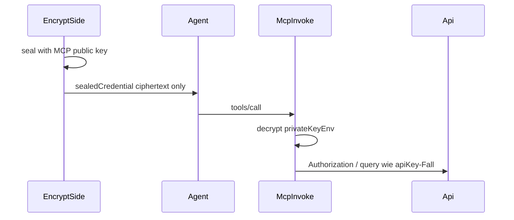

# Plan: Versiegeltes Geheimnis durch Agent → MCP entschlüsselt

## DSL: `apiKey` **oder** `sealedSecret` (Alternativen)

Das Modell hat optional **genau einen** Auth-Block — wahlweise klassisch oder versiegelt (`sealedCredential` später **nur** bei `sealedSecret`):

| Variante | Bedeutung |
|----------|-----------|
| `auth apiKey { … }` | Wie heute: Klartext aus `process.env[env]`; kein Feld `sealedCredential` auf den Tools relevant. Siehe [api-2-ai-dsl.langium](../packages/language/src/api-2-ai-dsl.langium). |
| `auth sealedSecret { … }` | **Neu**: Kein API-Secret in Env für den Bearer selbst; der MCP-Prozess hält nur den **Private Key**. Der wirksame Bearer/API-Teil kommt verschlüsselt pro Aufruf als Tool-Argument `sealedCredential`. |

Syntax-Vorschlag (analog zu `apiKey`: `in`, `name`, optional `prefix`):

```txt
auth sealedSecret {
    in: header
    name: "Authorization"
    prefix: "Bearer "
    privateKeyEnv: "API2AI_MCP_SEAL_PRIVATE_KEY"
}
```

- **`privateKeyEnv`**: Env-Variable, deren **Wert** der PEM-/Raw-Private-Key zum Entschlüsseln ist — **nie** committen (nur lokal oder Host-Secrets).
- **Grammatik:** `Auth` wird zu **Alternative** `ApiKeyAuth | SealedSecretAuth` (wie oben zweites Keyword `sealedSecret`). Kein weiteres gleichzeitiges `auth`-Statement nötig; bei Bedarf später Validator-Warnung, falls es irgendwie doppelt gäbe.

**Begriffe:** **`sealedSecret`** = DSL-Modus („so authentisiert ihr euch gegen die API“). **`sealedCredential`** = MCP/JSON-Zod-Feld (**Ciphertext**/Blob im Tool-Call).

## Kern (technischer Nachweis)

1. Client verschlüsselt Klartext-Geheimnis mit **öffentlichem MCP-Schlüssel** → Blob `sealedCredential`.
2. Agent ruft Tool auf mit **nur diesem Blob**.
3. `invokeTool` bei `auth sealedSecret`: Private Key aus `process.env[privateKeyEnv]` → decrypt → zusammen mit `in`/`name`/`prefix` wie bei `resolveAuthValue` zur Upstream-Anfrage.



**Bestehendes `auth apiKey`**: unverändert; keine `sealedCredential`-Pflicht.

### Pro Tool-Aufruf

Mit `auth sealedSecret` gilt im **Minimal-Design**: Jeder MCP-**`tools/call`**, der den Upstream authentisiert soll, bringt wieder **`sealedCredential`** mit (der Agent/host reicht denselben Ciphertext jedes Mal mit — der MCP-Server hält den Klartext-Bearer nicht dauerhaft). **Ausnahmen** erst mit bewusster Erweiterung (z. B. MCP-Host hängt `sealedCredential` automatisch an jedem Call an, oder kurzlebiger Decrypt-Cache im Server).

## MVP-Umfang

- Plaintext nach Decrypt zunächst **ein String** (reicht für Bearer-Payload nach `prefix`).
- Krypto: **AEAD**/Standardpaket (kein Eigenbau).
- Generator: zweiter Pfad für `renderAuthConfig` / `invoke`-Block wenn `SealedSecret` im AST ([generator.ts](../packages/cli/src/generator.ts)).
- MCP: [mcp-server.ts](../packages/cli/src/mcp-server.ts) — wenn generiertes Modul `sealedSecret` hat, **`sealedCredential` optional im Tool-Schema** (sonst weiter wie ohne sealed).

## Optional später

- OAuth/`exp`/`jti`; GitHub-PAT-Demos; mehr siehe Ende der alten Diskussion oder [github/rest-api-description](https://github.com/github/rest-api-description).

## Abhängigkeit `mcp-tool-schemas-from-openapi`

Nach [mcp-tool-schemas-from-openapi.md](mcp-tool-schemas-from-openapi.md) kann `sealedCredential` pro Tool formal im JSON-Schema stehen; **ohne** den Plan gilt weiter das globale optionale Feld im generierten Stub.

---

_Arbeitskopie unter `.cursor/plans/`._
