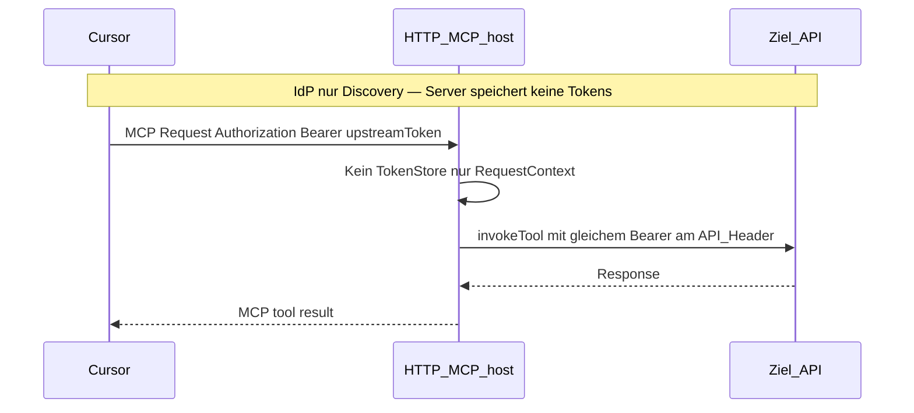
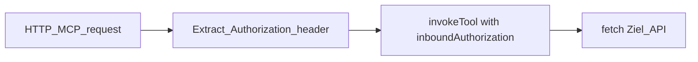
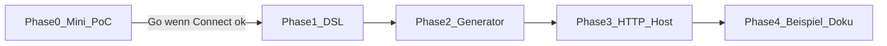

# Plan: DSL HTTP-MCP, optionales IdP (PRM), Bearer-Passthrough

> **Cancelled (2026-05):** Out of scope for the open PoC. Runtime OAuth/HTTP MCP is a separate product/licensing topic. Active PoC uses stdio MCP only — see root [README.md](../../../README.md#scope-of-this-poc-product-boundary).

## Zielbild (deine Vorgaben)



- **stdio** (Default): unverändert heutiges Modell — [`mcp-server.ts`](packages/cli/mcp-bundle/mcp-server.ts) + `StdioServerTransport`, `bearerEnv` / `bearerSealed`.
- **http**: Streamable-HTTP-MCP; **kein** Refresh/Token-Cache im Server.
- **IdP (optional)**: nur **OAuth 2.0 Protected Resource Metadata** (RFC 9728) + `401`/`WWW-Authenticate`, damit Cursor den Authorization Server findet ([MCP Authorization](https://modelcontextprotocol.io/specification/2025-03-26/basic/authorization)). **Keine** Token-Verwaltung, kein `/token`-Endpoint im api2ai-Host.
- **Auth bei http**: `bearerPassthrough` (Produktion) und optional `bearerEnv` (lokales Dev ohne Cursor-OAuth). `bearerSealed` nur bei **stdio** (Validator-Fehler bei http+sealed).

---

## 1. DSL-Erweiterung ([`api-2-ai-dsl.langium`](packages/language/src/api-2-ai-dsl.langium))

**Transport (neu, optional — Default = stdio):**

```txt
mcp stdio

mcp http {
    port: 3000
    idp {
        authorizationServer: "https://github.com"
        resource: "https://localhost:3000/mcp"
        scopes: "read:user" "repo"
    }
}
```

| Feld                  | Pflicht                     | Bedeutung                                                                               |
| --------------------- | --------------------------- | --------------------------------------------------------------------------------------- |
| `mcp stdio`           | —                           | Generiert/erwartet stdio-Host (heute)                                                   |
| `mcp http { … }`      | —                           | HTTP-Host                                                                               |
| `port`                | nein (Default z. B. `3000`) | Bind-Port (nur Runtime-Hinweis im Export)                                               |
| `idp { … }`           | nein                        | PRM-Inhalt; ohne IdP: HTTP ohne MCP-OAuth-Discovery (Dev mit `bearerEnv` möglich)       |
| `authorizationServer` | ja (wenn `idp`)             | Eintrag in PRM `authorization_servers`                                                  |
| `resource`            | nein                        | Canonical Resource URI (RFC 8707); Default aus Generator: `http://127.0.0.1:{port}/mcp` |
| `scopes`              | nein                        | Dokumentation in PRM / Hinweis für Cursor-`mcp.json` (nicht vom Server ausgehandelt)    |

**Auth (erweitern):**

```txt
auth bearerPassthrough {
    in: header
    name: "Authorization"
    prefix: "Bearer "
}
```

Gleiche Felder wie `bearerEnv`, aber **ohne** `env` — Secret kommt pro Request vom MCP-Client.

Nach Änderung: `npm run langium:generate` (Workspace-Regel).

---

## 2. Validator ([`api-2-ai-dsl-validator.ts`](packages/language/src/api-2-ai-dsl-validator.ts))

Neue Regeln (mit Tests in [`validating.test.ts`](packages/language/test/validating.test.ts)):

| Kombination                            | Ergebnis                                                  |
| -------------------------------------- | --------------------------------------------------------- |
| kein `mcp`                             | `transport: stdio` (implizit)                             |
| `mcp http` + `auth bearerSealed`       | **Error**                                                 |
| `mcp http` + `auth bearerPassthrough`  | OK                                                        |
| `mcp http` + `auth bearerEnv`          | OK (Dev)                                                  |
| `mcp stdio` + `auth bearerPassthrough` | **Error** (oder Warning → lieber Error, klarere Semantik) |
| `idp` ohne `mcp http`                  | **Error**                                                 |
| `idp` ohne `authorizationServer`       | **Error**                                                 |

Bestehende Auth-/Block-Checks für `bearerPassthrough` analog `bearerEnv` (`in`, `name`, optional `prefix`).

Completion ([`api-2-ai-dsl-completion-provider.ts`](packages/language/src/api-2-ai-dsl-completion-provider.ts)): Keywords `mcp`, `http`, `stdio`, `idp`, `bearerPassthrough`, IdP-Felder.

---

## 3. Generator — generiertes Tool-Modul ([`generator.ts`](packages/cli/src/generator.ts))

### 3.1 Export `mcpRuntimeConfig`

Am generierten `*-tools.mjs` zusätzlich exportieren (neben `generatedTools`, `invokeTool`, `inputSchemaByTool`):

```ts
export const mcpRuntimeConfig = {
  transport: 'stdio' | 'http',
  port?: number,
  idp?: { authorizationServer: string; resource?: string; scopes?: string[] }
};
```

[`mcp-server.ts`](packages/cli/mcp-bundle/mcp-server.ts) liest nach Import des Tool-Moduls `mcpRuntimeConfig` und wählt Transport.

### 3.2 `authKind: 'passthrough'`

- `renderAuthConfig`: `kind: 'bearerPassthrough'`, Felder `location`, `name`, `prefix`.
- `resolveAuthSecret` (generierter Code): liest `options.inboundAuthorization` (vom Host gesetzt), validiert Nicht-Leer; wendet `prefix` an (siehe Abschnitt 5 — Header-Normalisierung).
- **Kein** `sealedCredential` im JSON-Schema; Tool-Beschreibung: Runtime-Auth-Hinweis für Passthrough.
- `bearerEnv`/`bearerSealed`-Codegen unverändert für stdio.

### 3.3 `invokeTool`-Signatur

`GeneratedInvokeOptions` im Host und Generator um optionales Feld erweitern:

```ts
inboundAuthorization?: string;  // roher Authorization-Header-Wert vom MCP-HTTP-Request
```

Nicht im MCP-Tool-`inputSchema` (Agent soll kein Token eingeben).

---

## 4. MCP-Host — HTTP + PRM, kein Token-Store ([`mcp-bundle/`](packages/cli/mcp-bundle/))

### 4.1 Struktur

- [`mcp-server.ts`](packages/cli/mcp-bundle/mcp-server.ts): Transport-Fabrik `stdio | http`.
- Neues Modul z. B. `mcp-http-server.ts`:
    - Node-HTTP(S) + **Streamable HTTP** aus `@modelcontextprotocol/sdk` (Version [^1.29.0](packages/cli/package.json) — **Implementierungs-Spike**: exakte Imports/`mcpAuthRouter` im SDK verifizieren).
    - Route **Protected Resource Metadata** (RFC 9728 Pfad laut MCP-Spec, z. B. `/.well-known/oauth-protected-resource` relativ zur MCP-Base-URL).
    - Bei fehlendem/ungültigem MCP-`Authorization`: **401** + `WWW-Authenticate` mit `resource_metadata=…` (nur wenn `idp` in DSL gesetzt; sonst 401 ohne OAuth-Hinweis oder konfigurierbar „strict“).

### 4.2 Request → Tool: Bearer durchreichen



- Pro Tool-Handler: `Authorization` aus Request-Context (SDK-Auth-Context oder `AsyncLocalStorage` um Handler — im Spike festlegen).
- An `invokeTool(…, { …, inboundAuthorization })` übergeben.
- **Nicht** persistieren, **nicht** refresh.

### 4.3 stdio-Pfad

Unverändert: kein `inboundAuthorization`; `bearerEnv` / `bearerSealed` wie heute.

### 4.4 Bundle

- `npm run bundle:mcp-runtime` erweitert; [`mcp-serve-emitted.mjs`](packages/cli/resources/mcp-serve-emitted.mjs) kopiert wie bisher nach `examples/generated/cli/`.
- HTTP-Modus kann `express` o. ä. brauchen — Abhängigkeit in [`packages/cli/package.json`](packages/cli/package.json) / examples-bootstrap prüfen (minimal halten).

[^1.29.0]: Falls Streamable-HTTP-Auth-API im SDK fehlt oder unzureichend: dokumentierter Fallback — dünnster eigener HTTP-Wrapper nur für `/mcp` + PRM, MCP-Protokoll über SDK-Transport.

---

## 5. Bearer-Normalisierung (Passthrough)

Einheitliche Regel im generierten `resolveAuthSecret`:

1. `inboundAuthorization` vom Host (vollständiger Header-Wert).
2. Wenn Wert mit `Bearer ` beginnt (case-insensitive): Token-Teil extrahieren.
3. `prefix` aus DSL anwenden (z. B. `Bearer ` + token) → API-Header `authConfig.name`.

So funktioniert Cursor (sendet oft `Bearer …`) und GitHub-API gleichzeitig.

---

## 6. Beispiele & Doku

| Artefakt                                                                   | Aktion                                                                                                                                                                                                          |
| -------------------------------------------------------------------------- | --------------------------------------------------------------------------------------------------------------------------------------------------------------------------------------------------------------- |
| Neues [`examples/github-http.api2ai`](examples/github-http.api2ai)         | `mcp http` + `idp` (GitHub) + `auth bearerPassthrough`; gleiche Operations wie [`github.api2ai`](examples/github.api2ai)                                                                                        |
| [`github.api2ai`](examples/github.api2ai)                                  | bleibt stdio + `bearerSealed` (bestehendes Demo)                                                                                                                                                                |
| [`examples/.cursor/mcp.json.example`](examples/.cursor/mcp.json.example)   | Zusätzlicher Eintrag `url: "http://127.0.0.1:3000/mcp"` für HTTP-Beispiel; Hinweis: OAuth-Client bei GitHub + Redirect `cursor://anysphere.cursor-mcp/oauth/callback` (**manuell**, nicht vom Server verwaltet) |
| [`examples/README.md`](examples/README.md) / Root [`README.md`](README.md) | Abschnitt HTTP vs stdio, PRM/IdP, Passthrough, kein Token-Store                                                                                                                                                 |
| Root `package.json`                                                        | `generate:github-http-tools` Script                                                                                                                                                                             |

---

## 7. Abgrenzung / Nicht-Ziele

- **Kein** OAuth Authorization Server, **kein** `/token`, **kein** Refresh-Token-Speicher im api2ai-Host.
- **Kein** automatisches Generieren von `CLIENT_ID`/`CLIENT_SECRET` in Repo (PRM-only laut deiner Wahl).
- **Kein** Wiederverwenden des Cursor-GitHub-IDE-Logins.
- Cursor-OAuth-Client-Registrierung beim IdP bleibt **Betriebs-/Setup-Schritt** (Doku).
- Extension-Embed-CLI ([`vscode-bundle-cli-entry.ts`](packages/cli/src/vscode-bundle-cli-entry.ts)): nur `generate` — **kein** HTTP-Host in VSIX nötig für PoC.

---

## 8. Verifikation

1. `npm run langium:generate && npm run build`
2. `npm test` (language)
3. `npm run generate:github-http-tools`
4. HTTP-Host starten, PRM-URL per `curl` prüfen
5. Mit `bearerEnv` auf http: Smoke ohne Cursor (curl MCP mit festem Bearer oder Env-only-Dev)
6. Mit Cursor: `mcp.json` `url` + Connect; Tool-Call → GitHub `GET /user` (manuell)
7. stdio-Beispiele (`tmdb`, `github` sealed) regression: `test:smoke`, bestehende MCP-Einträge

---

## 9. Was noch unklar ist (vor Implementierung)

| Thema                                                                                                                                 | Status          | Wo geklärt                                                               |
| ------------------------------------------------------------------------------------------------------------------------------------- | --------------- | ------------------------------------------------------------------------ |
| SDK: Streamable HTTP + Auth-Context pro Request                                                                                       | **Spike nötig** | Phase 0 / Phase 3                                                        |
| GitHub als `authorizationServer` in PRM — akzeptiert Cursor das und liefert ein **GitHub-API-Token** (nicht nur ein opaques MCP-JWT)? | **PoC-Risiko**  | Phase 0 — sonst Fallback-Doku (eigener AS / statisches `mcp.json`-OAuth) |
| Exakter PRM-Pfad + `WWW-Authenticate`-Format für Cursor                                                                               | **PoC**         | Phase 0 (`curl` + Connect)                                               |
| TLS/öffentliche URL vs. `localhost` (Redirect, Resource URI)                                                                          | Betrieb         | Doku; lokal oft `127.0.0.1` + manueller Token-Test parallel              |

**Fachlich klar (kein PoC nötig):** Passthrough-Architektur, kein Token-Store, stdio vs. http, PRM-only IdP, `bearerEnv` für HTTP-Dev.

---

## 10. Empfehlung: nicht alles auf einmal

Der ursprüngliche Plan ist **eine zusammenhängende Lieferung** (~1–2 Wochen). Sinnvoller ist **5 Phasen** mit klarem Stop/go nach Phase 0:



### Phase 0 — Mini PoC Cursor + IdP (**empfohlen, 1–2 Tage**)

**Ziel:** Integration-Risiko abbauen **ohne** DSL/Generator anzufassen.

- Kleiner Fork in [`mcp-bundle/`](packages/cli/mcp-bundle/): fester HTTP-Server, **hardcoded** PRM (GitHub als `authorization_servers`), **ein** Tool aus bestehendem [`github-tools.mjs`](examples/generated/tools/github-tools.mjs) oder direkter `fetch` `GET /user`.
- Passthrough: `Authorization` vom MCP-Request → GitHub-Header.
- Manuell: `curl` PRM; Cursor `mcp.json` mit `url` + ggf. `auth.CLIENT_ID` (GitHub OAuth App); Connect → Tool-Call.
- **Ergebnis dokumentieren:** Connect ja/nein, Token-Typ, ob `GET /user` 200.

**Stop-Kriterium:** Wenn Phase 0 scheitert, erst Architektur anpassen (z. B. IdP nicht GitHub direkt), **nicht** DSL bauen.

### Phase 1 — DSL + Validator (~1–2 Tage)

Grammatik + Tests; **noch kein** lauffähiger HTTP-Host aus Generator.

### Phase 2 — Generator (~1–2 Tage)

`mcpRuntimeConfig`, `bearerPassthrough`, `inboundAuthorization`; bestehende stdio-Beispiele unverändert generieren.

### Phase 3 — HTTP-Host aus Phase 0 (~2–3 Tage)

Transport-Umschaltung via `mcpRuntimeConfig`; PRM aus DSL-`idp`.

### Phase 4 — Beispiel + Doku (~1 Tag)

[`github-http.api2ai`](examples/github-http.api2ai), README, `mcp.json.example`.

**Optional weglassen in v1:** Completion für neue `mcp`/`idp`-Keywords (kann nach Phase 1 nachgezogen werden).

---

## 11. Brauchen wir den Mini PoC?

**Ja, empfohlen** — nicht weil die Architektur unklar ist, sondern weil **Cursor × PRM × GitHub** die größte Unbekannte ist:

- Ob Cursor bei PRM mit `authorization_servers: ["https://github.com"]` den erwarteten Flow startet.
- Ob das ankommende Bearer-Token **direkt** für `api.github.com` reicht (Passthrough-Annahme).

Ohne Phase 0 riskiert ihr, DSL + Generator + Host zu bauen und erst am Ende zu merken, dass IdP/Redirect/Token-Typ angepasst werden müssen.

**Parallel möglich:** Phase 0 kann während Code-Review an Langium/Generator laufen (andere Person/Zeit).

---

## 12. Implementierungsreihenfolge (aktualisiert)

1. **Phase 0** — Mini PoC (Cursor + IdP + Passthrough)
2. **Phase 1** — DSL + Validator + Tests
3. **Phase 2** — Generator
4. **Phase 3** — MCP HTTP-Host (PoC-Logik übernehmen)
5. **Phase 4** — `github-http` + Doku + E2E

Nach Abschluss: Plan nach [`.cursor/plans/done/`](.cursor/plans/done/) verschieben (Workspace-Regel).
