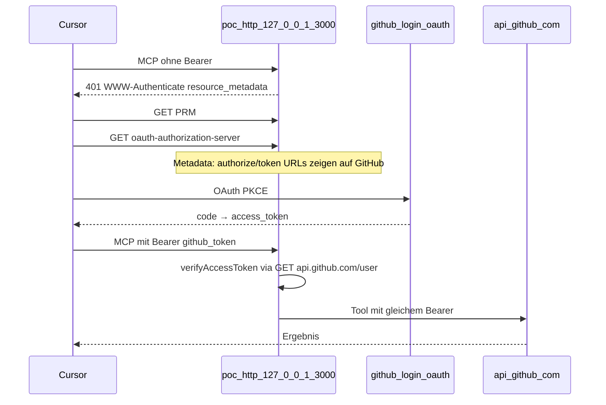

# Plan: examples HTTP + GitHub OAuth PoC (Phase 0)

> **Cancelled (2026-05):** PoC code removed from the repo (`examples/poc-http-github/`). PRM/401 worked via curl; Cursor E2E was not pursued. See [dsl-http-oauth-passthrough.plan.md](dsl-http-oauth-passthrough.plan.md).

## Ziel

Nachweisen, dass **Cursor** einen **lokalen HTTP-MCP** findet, bei **401** den **Login-Flow** startet, und das erhaltene **Bearer** für **GitHub REST** nutzbar ist (Passthrough). Alles **hardcoded** unter [`examples/poc-http-github/`](examples/poc-http-github/) — **keine** DSL/Generator-Änderungen.

## Nicht-Ziele

- Kein Token-Refresh/-Speicher im Server
- Kein `bearerSealed` / keine Produktions-Architektur
- Kein GitHub als RFC-8414-issuer auf `github.com` (404) — Workaround unten

## Architektur



### Workaround GitHub ohne `.well-known/oauth-authorization-server`

- **issuer** = `http://127.0.0.1:{port}` (PoC-Server)
- [`mcpAuthMetadataRouter`](node_modules/@modelcontextprotocol/sdk/dist/esm/server/auth/router.js) liefert auf dem PoC-Host:
  - PRM: `authorization_servers: [issuer]`
  - AS-Metadata: `authorization_endpoint` / `token_endpoint` → **GitHub** (`/login/oauth/authorize`, `/login/oauth/access_token`)
- Env: `MCP_DANGEROUSLY_ALLOW_INSECURE_ISSUER_URL=true` (HTTP-issuer)

### Token-Verifikation (MCP-Layer, kein Store)

- `requireBearerAuth` + Verifier: `GET https://api.github.com/user` mit Token
- Bei 200: `req.auth.token` für Tool; bei Fehler: 401

### Tool (Passthrough-Demo)

- Ein Tool: `getGitHubAuthenticatedUser` — `fetch` `GET /user` mit `Authorization: Bearer ${req.auth.token}`

## Dateien

| Datei | Zweck |
|-------|--------|
| [`examples/poc-http-github/mcp-server.mjs`](examples/poc-http-github/mcp-server.mjs) | Server (angelehnt an SDK `simpleStreamableHttp.js --oauth`) |
| [`examples/poc-http-github/README.md`](examples/poc-http-github/README.md) | Setup & Test |
| [`examples/.cursor/mcp.json.example`](examples/.cursor/mcp.json.example) | Optionaler Eintrag `api2ai-poc-github-http` |

## Cursor-Setup (manuell)

1. GitHub OAuth App: Redirect `cursor://anysphere.cursor-mcp/oauth/callback`
2. `examples/.cursor/mcp.json`:

```json
"api2ai-poc-github-http": {
  "url": "http://127.0.0.1:3000/mcp",
  "auth": {
    "CLIENT_ID": "<GitHub OAuth App Client ID>",
    "CLIENT_SECRET": "<secret>",
    "scopes": ["read:user", "repo"]
  }
}
```

3. Server: `MCP_DANGEROUSLY_ALLOW_INSECURE_ISSUER_URL=1 node examples/poc-http-github/mcp-server.mjs`
4. Cursor → Settings → Tools & MCP → Connect

## Erfolgskriterien

- [x] `curl -s http://127.0.0.1:3000/.well-known/oauth-protected-resource/mcp` → JSON mit `authorization_servers`
- [x] MCP POST ohne Auth → **401** + `resource_metadata` in `WWW-Authenticate`
- [ ] Cursor: Server sichtbar, Connect öffnet Browser (GitHub)
- [ ] Tool `getGitHubAuthenticatedUser` liefert GitHub-User-JSON

## Bekannte Risiken / Fallbacks

| Risiko | Fallback |
|--------|----------|
| Cursor öffnet Browser nicht | URL aus MCP-Log / Doku |
| GitHub OAuth + `cursor://` Redirect nicht registriert | OAuth App prüfen |
| Token nicht GitHub-API-fähig | Scopes `read:user` |
| PoC scheitert | Phase-1-DSL erst nach Anpassung der IdP-Story |

## Abhängigkeit zum Hauptplan

Ergebnis fließt in [dsl-http-oauth-passthrough_...plan.md](dsl-http-oauth-passthrough_overview_dsl_wählt_stdio-_oder_http-mcp-runtime;_http_optional_mit_idp-me_0e98b246.plan.md) Phase 0 — bei Erfolg Phase 1 starten.

## Aufwand

~0,5–1 Tag Implementierung + ~0,5 Tag manueller Cursor-Test (inkl. GitHub OAuth App).
