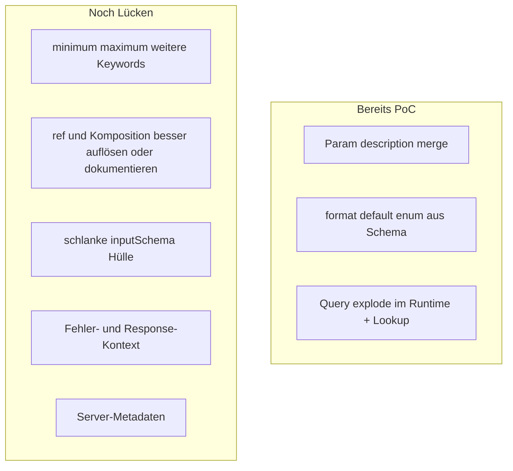

# Plan: Review-Vorschläge einordnen und nächste Schritte

## Kurzantwort: Warum „Punkt 1“ sich trotzdem noch anfühlt wie offen

Im abgeschlossenen PoC-Plan ([`.cursor/plans/done/agent-qualitaet-poc.plan.md`](.cursor/plans/done/agent-qualitaet-poc.plan.md)) war **Punkt 1** konkret: **Parameter-`description` aus OpenAPI in die Property-Schemas mergen** — umgesetzt in [`parameterPropertySchema`](packages/cli/src/openapi-tool-codegen.ts) (Merge von `p.description` auf das aus `p.schema` konvertierte JSON-Schema).

Das **breitere** Review-Thema „Parameter-Dokumentation“ umfasst zusätzlich **`minimum` / `maximum`**, ggf. weitere Keywords (`pattern`, `minLength`/`maxLength`, `exclusiveMinimum`/`exclusiveMaximum`), und **robuste Abbildung bei `$ref` / Komposition** (`oneOf`/`allOf`/`anyOf`), wo [`openApiSchemaToJsonSchema`](packages/cli/src/openapi-tool-codegen.ts) heute bewusst auf ein **degradiertes** Objekt-Schema ausweicht — dann gehen **alle** Inline-Metadaten verloren.

**Aktueller Evidenz-Stand in den Beispielen** (nach Regenerierung):

- Open-Meteo Geocoding: [`examples/generated/tools/open-meteo-geocoding-tools.ts`](examples/generated/tools/open-meteo-geocoding-tools.ts) hat **Beschreibungen** für `name`, `count`, `language`, `countryCode`, aber **`count` ohne `minimum`/`maximum`**, obwohl die Spec ([`examples/openapi/open-meteo-geocoding.openapi.yaml`](examples/openapi/open-meteo-geocoding.openapi.yaml)) `1`–`100` definiert — das bestätigt die **noch fehlende Durchreichung numerischer Constraints**.
- TMDB: `movie_id` ist **`integer` + `format: int32`**, `language` enthält **`default: "en-US"`** — die Review-Beispiele („number“, fehlendes Default) wirken auf **ältere Artefakte** oder eine **andere Export-Datei** bezogen, nicht auf den aktuellen Generator-Output.

---

## Bewertung der acht Review-Punkte

| # | Thema | Einschätzung | Priorität |
|---|--------|--------------|-----------|
| 1 | Metadaten im JSON Schema | **Teilweise erledigt** (Descriptions, `format`, `default`, `enum` aus Schema). **Offen:** `minimum`/`maximum` etc.; `$ref`/Komposition. | Hoch |
| 2 | integer vs number | **In den geprüften Beispielen bereits `integer`** (TMDB, Spaceflight). Risiko bleibt bei **degradierten** Schemas. | Mittel (gezielt testen) |
| 3 | Enums tokenlastig | **Beispiele nutzen bereits `enum`-Arrays**; anyOf-`const`-Ketten ggf. nur in anderen Specs oder bei **nullable**/Komposition — optional **normalisieren** (`enum` + `null` statt langer `anyOf`). | Niedrig–Mittel |
| 4 | Immer gleiche Hülle | **Valid**: leere `pathParams`, generisches `body` und oft generische `headers` **irreführend** und teuer. | Hoch (UX/Tokens) |
| 5 | Query style/explode | **Runtime** in [`generator.ts` `appendSerializedQueryParams`](packages/cli/src/generator.ts) setzt `explode: false` → **kommasepariert**; fehlt vor allem **Sichtbarkeit** in der Tool-Beschreibung bei Abweichung vom Default. | Mittel |
| 6 | Response-/Fehlerinfos | [`buildMcpDescription`](packages/cli/src/openapi-tool-codegen.ts) kann über `operation.includeResponses` eine **Success-Zeile** einbauen; **4xx/5xx-Schemata** und typische Fehlerursachen fehlen in `tools/list`. Runtime-Fehlertexte wurden im PoC bereits verbessert (401/403/429). | Mittel |
| 7 | Defaults | **`default` wird aus dem Schema übernommen** ([`openApiPrimitiveToJsonSchema`](packages/cli/src/openapi-tool-codegen.ts)); wenn etwas fehlt, eher **Spezialfall** (nur `example`, anderes Media-Type, Komposition). | Niedrig (Fall prüfen) |
| 8 | Server-Metadaten | Sinnvoll **später** (`info.version`, `servers`, ggf. Rate-Limit-Hinweise aus Description/Extensions) — kein Blocker für Schema-Qualität. | Niedrig |

---

## Konkrete Umsetzungsschritte (empfohlene Reihenfolge)

### A. Schema-Vollständigkeit (Review 1 + Teile von 2 und 7)

- In [`OpenApiSchema`](packages/language/src/openapi.ts) die für MCP relevanten JSON-Schema-Keywords ergänzen (**mindestens** `minimum`, `maximum`; optional `exclusiveMinimum`, `exclusiveMaximum`, `minLength`, `maxLength`, `pattern`, `minItems`, `maxItems`).
- In [`openApiPrimitiveToJsonSchema`](packages/cli/src/openapi-tool-codegen.ts) diese Felder **durchreichen**, analog zu `description`/`format`/`default`.
- Tests: kleine OpenAPI-Fixture mit `minimum`/`maximum` am Query-Param; Assertion auf generiertes `inputSchemaByTool`-Snippet (CLI- oder Snapshot-Test).

**Optional nächste Stufe:** Für Parameter-Schemas mit **alleinstehendem `$ref`**: nach `SwaggerParser.validate` ist der AST oft aufgelöst — prüfen, ob `p.schema` noch `$ref` trägt; falls ja, **dereferenzieren** oder im Validator **warnen**, dass Metadaten fehlen könnten.

### B. Schlankere Tool-`inputSchema`-Hülle (Review 4)

- In [`buildToolInputSchema`](packages/cli/src/openapi-tool-codegen.ts) nur **benötigte** Top-Level-Keys erzeugen:
  - `pathParams` nur wenn Path-Parameter existieren (statt „No path parameters“ mit `additionalProperties: true`).
  - `query` nur wenn Query-Parameter existieren (oder bewusst weglassen / sehr schmales Objekt — **Breaking Change** für Aufrufer: `InvokeOptions` und Zod in [`mcp-server.ts`](packages/cli/mcp-bundle/mcp-server.ts) / [`mcp-serve-emitted.mjs`](packages/cli/resources/mcp-serve-emitted.mjs) müssen **optional** bleiben und mit fehlenden Keys umgehen).
  - `body` weglassen oder **`not` applicable**-Hinweis nur im Text, wenn keine Request-Body-Schema — statt generischem `additionalProperties`-Objekt.
  - `headers` nur wenn Header-Parameter aus der Spec **oder** wenn Security explizit Header erfordert (sonst weglassen oder minimieren).

Abhängigkeit: **einheitliche** Konvention in Runtime (`invokeTool`, MCP-Args), dass fehlende Buckets wie „nicht übergeben“ behandelt werden.

### C. Serialisierung sichtbar machen (Review 5)

- Hilfsfunktion: für eine Operation ermitteln, ob mindestens ein Query-Array **`explode: false`** hat (oder anderes als Default laut [`effectiveQueryParamSerialization`](packages/cli/src/openapi-tool-codegen.ts)).
- Wenn ja, **einen Satz** in [`buildMcpDescription`](packages/cli/src/openapi-tool-codegen.ts) ergänzen (z. B. „Array-Query-Parameter werden kommagetrennt gesendet, wenn explode=false.“), ohne die ganze OpenAPI-Serialisierung auszuschreiben.

### D. Responses und Fehler für Agenten (Review 6)

- Erweiterung von [`buildResponseParagraph`](packages/cli/src/openapi-tool-codegen.ts) / `buildMcpDescription` (wenn `includeResponses`): kurze Liste **nicht-2xx**-Status mit `description` aus OpenAPI (gekürzt, max. N Zeilen), optional Top-Level-Shape für **häufigste** Fehler-JSON (400), ohne riesige Schemas in `tools/list`.
- Abgrenzung: Fokus auf **kompakte** Textzusammenfassung; volle Response-Schemas gehören nicht in jedes Tool.

### E. Enums (Review 3)

- Nur falls in realen Specs **`anyOf`+`const`**-Ketten auftauchen: **Normalisierung** zu `enum` (+ optional `description` auf Array-Ebene statt pro Wert). Sonst: **kein Muss** — Beispiele sind bereits kompakt.

### F. Server-Metadaten (Review 8)

- Beim Generieren optional `SERVER_METADATA.json` oder Felder im MCP-Setup aus `info` + erster `servers`-URL anreichern — klar als **Follow-up** kennzeichnen.

---

## Abgrenzung / Risiken

- **Breaking Change:** Entfernen von Top-Level-Keys in `inputSchema` betrifft Clients, die immer `pathParams`/`body` erwarten — Migration: Runtime toleriert fehlende Keys; ggf. eine Generator-Flag-Phase „strictSlimSchema“.
- Vollständige **OpenAPI 3.1**-Semantik und alle Serialisierungs-Stile sind bewusst nicht MVP; Validator bleibt Leitplanke ([`getUnsupportedSerializationMessages`](packages/language/src/openapi.ts)).
