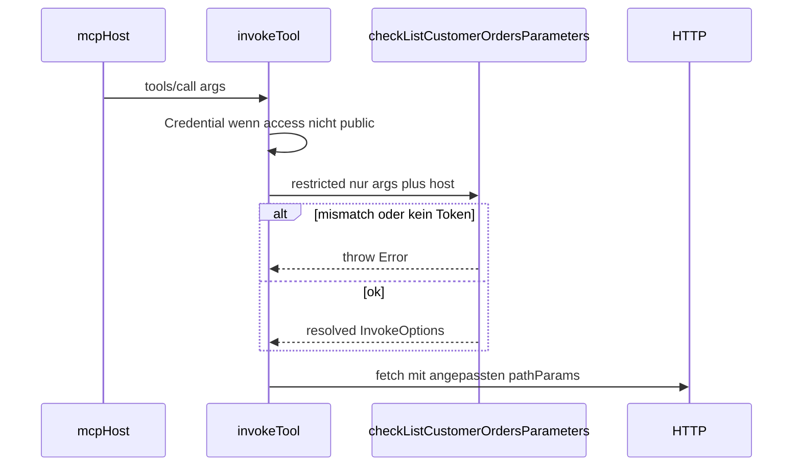

# Restricted: Parameter-Check statt authorize

## Deine Fragen (kurz)

| Frage                                                                                              | Antwort                                                                                                                                                                                                                                                          |
| -------------------------------------------------------------------------------------------------- | ---------------------------------------------------------------------------------------------------------------------------------------------------------------------------------------------------------------------------------------------------------------- |
| Ist [`listCustomerOrders.mjs`](packages/extension/demos/src/auth/listCustomerOrders.mjs) der Stub? | Ja, **write-once** (Generator legt ihn nur an, wenn fehlend).                                                                                                                                                                                                    |
| Warum „nirgends referenziert“?                                                                     | Doch — im **generierten** Modul, z. B. [`mock-api-tools.ts` Zeile 5 + 74–106](packages/extension/demos/generated/tools/mock-api-tools.ts): Import + `restrictedAuthorizers` + `assertToolAuthorized`. Die IDE verlinkt `src/auth` oft schlecht aus `generated/`. |
| Macht `check*Parameters` Sinn?                                                                     | **Ja** — deckt Validierung **und** Schritt‑2‑Mapping (JWT → `customerId`) in einem Schritt; passt zu „Programmierer kennt Tool-Args“.                                                                                                                            |
| `claims` noch nötig?                                                                               | **Nein** (von dir: entfernen). Typen leben im TS-Stub + optional exportierte `InvokeOptions` aus dem Generator.                                                                                                                                                  |
| Exception vs. `null`?                                                                              | **Exception** (`throw new Error('…')`) — eindeutig für MCP/Agent; `null`/`false` ist mehrdeutig (Fehler vs. leerer Call). Generator-Stub wirft bei Default.                                                                                                      |

---

## Ziel-Architektur



| `access`     | Credential | Stub `check*Parameters`          |
| ------------ | ---------- | -------------------------------- |
| `public`     | nein       | nein                             |
| `protected`  | ja         | nein                             |
| `restricted` | ja         | **ja**, in `invokeTool` vor HTTP |

**Entfallen:** `authorize`, `restrictedAuthorizers`, `assertToolAuthorized` (Export + Generator), MCP-Host-Hook davor.

**Festgelegt (bestätigt):** Alle Auth-Logik nur in `invokeTool`:

1. `access !== 'public'` → fehlendes Credential → `throw`
2. `access === 'restricted'` → `options = await check<Tool>Parameters(options, { credential, jwt })`
3. danach HTTP wie bisher (Header aus Credential)

**core2ai:** [`mcp-server.ts`](core2ai/packages/mcp-host/src/mcp-server.ts) ruft `assertToolAuthorized` nicht mehr auf; optional Typ `assertToolAuthorized` aus `GeneratedMcpModule` entfernen oder deprecated lassen.

---

## DSL (api2ai)

Datei: [`api-2-ai-dsl.langium`](packages/language/src/api-2-ai-dsl.langium)

- `claims` / `ClaimsSpec` / `ClaimEntry` **entfernen**
- `auth { in, name, prefix }` bleibt (ein Block pro Datei)
- `restricted` an Operation bleibt

Validator/Completion/Tests: alle `claims`-/`fromJwt`-Bezüge raus; Demo [`mock-api.api2ai`](packages/extension/demos/mock-api.api2ai) ohne `claims { }`.

---

## Stubs (TypeScript + esbuild)

**Pfad (write-once):** `src/auth/<toolName>.ts`  
**Beispiel mock-api:** `checkListCustomerOrdersParameters` (Name im Generator: `check` + PascalCase(toolName) + `Parameters`)

```ts
// src/auth/listCustomerOrders.ts (Vorschlag)
import type { InvokeOptions } from '../../generated/tools/mock-api-tools.js';

export type RestrictedHostContext = {
    credential: string;
    jwt?: Record<string, unknown>;
};

export function checkListCustomerOrdersParameters(options: InvokeOptions, host: RestrictedHostContext): InvokeOptions {
    const jwtCustomer = String(host.jwt?.customerId ?? '');
    let customerId = options.pathParams?.customerId;
    if (customerId == null || String(customerId).trim() === '') {
        customerId = jwtCustomer;
    }
    if (String(customerId) !== jwtCustomer) {
        throw new Error(`customerId "${customerId}" does not match JWT claim "${jwtCustomer}".`);
    }
    return {
        ...options,
        pathParams: { ...options.pathParams, customerId: String(customerId) }
    };
}
```

**Generator** ([`auth-stub-render.ts`](packages/cli/src/generator/auth-stub-render.ts)):

- Stub-Template `.ts` statt `.mjs`
- Export-Typ `InvokeOptions` aus generiertem Modul (relativer Import in Stub-Kommentar/Template)
- Nach `ensureRestrictedAuthStubs`: **esbuild** alle `src/auth/*.ts` → `src/auth/*.mjs` (nur geänderte Dateien oder immer — einfach: alle `.ts` im Ordner)
- Generiertes Modul importiert `../../src/auth/listCustomerOrders.mjs`

Neue Hilfsdatei z. B. [`auth-stub-compile.ts`](packages/cli/src/generator/auth-stub-compile.ts) (esbuild als devDependency api2ai-cli, falls noch nicht da).

---

## Codegen / Runtime

| Datei                                                                   | Änderung                                                                                             |
| ----------------------------------------------------------------------- | ---------------------------------------------------------------------------------------------------- |
| [`auth-stub-render.ts`](packages/cli/src/generator/auth-stub-render.ts) | Stubs + `parameterCheckers` Map + `renderInvokeParameterCheck`                                       |
| [`invoke-render.ts`](packages/cli/src/generator/invoke-render.ts)       | Am Anfang von `invokeTool`: für `restricted`, `options = await checkX(options, { credential, jwt })` |
| [`auth-stub-render.ts`](packages/cli/src/generator/auth-stub-render.ts) | `renderAssertToolAuthorizedBlock` **entfernen**; nur noch `parameterCheckers` + Stub-TS              |
| [`module-render.ts`](packages/cli/src/generator/module-render.ts)       | `authClaims` / `AuthClaims` **entfernen**; kein `assertToolAuthorized` im generierten Modul          |
| [`generator.ts`](packages/cli/src/generator.ts)                         | Kein `assertBlock` mehr im `toolRuntimeBlock`                                                        |
| [`openapi-tool-codegen.ts`](packages/cli/src/openapi-tool-codegen.ts)   | Runtime-Text: `check*Parameters` in `src/auth/<tool>.ts`                                             |
| [`generator.ts`](packages/cli/src/generator.ts)                         | esbuild-Schritt nach Write; Imports anpassen                                                         |

**MCP-Host** ([`mcp-server.ts`](core2ai/packages/mcp-host/src/mcp-server.ts), [`mcp-host-adapter.ts`](core2ai/packages/mcp-host/src/mcp-host-adapter.ts)): `await assertToolAuthorized(...)` entfernen; `npm run bundle:mcp-runtime` in api2ai.

---

## Demo & Tests

- Stub migrieren: [`listCustomerOrders.mjs`](packages/extension/demos/src/auth/listCustomerOrders.mjs) → `.ts` mit Parameter-Logik (alice/bob-Beispiel)
- `.mjs` per generate erzeugen; alte `.mjs` manuell löschen wenn durch TS ersetzt
- Integration/E2E: `assertToolAuthorized`-Aufrufe entfernen; angepasste `pathParams` / Fehler bei Mismatch
- [`mock-api/README.md`](packages/extension/demos/mock-api/README.md) anpassen
- Language-Tests: `claims`/`fromJwt` Tests entfernen

---

## Was noch fehlen könnte (bewusst im Plan)

- **Kein generisches `checkToolParameter`** — pro Tool eigene Funktion (klarer, eine Datei pro Tool); Generator verdrahtet Namen.
- **JWT decode** bleibt im generierten `mcpHostAdapter` (unsafe payload); Stub bekommt `jwt` fertig.
- **OpenAPI-Schema** bleibt unverändert (`customerId` weiter im Zod-Schema); Anreicherung nur im Stub — Agent kann leeres `customerId` senden, Stub füllt aus Token.
- **core2ai-Tag**: nach MCP-Anpassungen wie bisher `file:`/neuer Git-Tag für `@core2ai/core`.

---

## Nicht in diesem Schritt

- Claim→Parameter-Deklaration in der DSL (war Schritt 2 im alten Plan — jetzt im Stub)
- db2ai-Port
