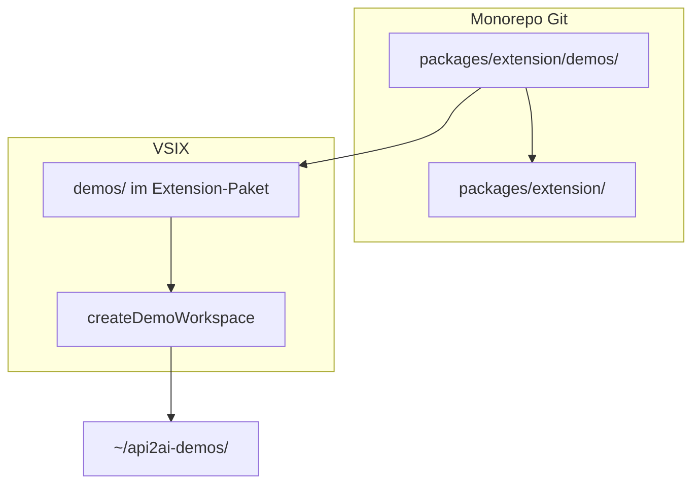

# Demo-Examples über die VSIX (ohne Repo-Checkout)

## Kurzantwort

| Frage | Antwort |
|-------|---------|
| **Doppelt im Repo?** | **Nein** — mit Verschiebung gibt es nur **einen** Ordner: [`packages/extension/demos/`](packages/extension/demos/). |
| **Yeoman / npm create?** | Nicht nötig; du lieferst über **VSIX + Befehl**. |
| **Publish?** | Nur die **VSIX** (Release / Install from VSIX). |

---

## Eine Quelle statt zwei (dein Vorschlag)

### Optionen im Vergleich

| Ansatz | Git | VSIX | Wartung |
|--------|-----|------|---------|
| **A: `examples/` + `extension/demos/` + Sync** | Zwei Bäume | demos in VSIX | Sync/CI, Drift-Risiko |
| **B: Nur Build-Kopie** (`examples/` bleibt, Copy bei `extension:vsix`) | Ein Baum | Kopie nur im Artefakt | Kein Duplikat in Git, aber zwei Pfade mental |
| **C: Verschieben → `packages/extension/demos/`** | **Ein Baum** | Derselbe Ordner wird gepackt | **Empfohlen** |

**Empfehlung: Option C** — der gesamte [`examples/`](examples/)-Ordner wandert nach [`packages/extension/demos/`](packages/extension/demos/). Damit entfällt Sync-Skript und CI-Check „in sync“.



### Was sich beim Verschieben ändert (Maintainer)

- [`git mv examples packages/extension/demos`](packages/extension/demos)
- [`.vscode/launch.json`](.vscode/launch.json): Extension Development Host öffnet `${workspaceFolder}/packages/extension/demos` statt `examples/`
- Root [`package.json`](package.json): `test:smoke*` / `test:mcp` → `./packages/extension/demos/generated/...`
- [`.gitignore`](.gitignore): `examples/...` → `packages/extension/demos/...`
- Root [`README.md`](README.md), [`packages/cli/README.md`](packages/cli/README.md): Links `./examples/` → `./packages/extension/demos/` (oder Kurzname „Demos“ in der Doku)
- [`demos/package.json`](packages/extension/demos/package.json): `generate:*` → `node scripts/generate.mjs …` (CLI-Auflösung s. oben)

**Nicht** in die VSIX / nicht ins Nutzer-Bundle kopieren: `node_modules/`, `generated/`, `package-lock.json`, `.env.local`.

### Pfad-Checkliste (bei Umsetzung vollständig abarbeiten)

**Konfiguration / Build**

| Datei | Änderung |
|-------|----------|
| [`.vscode/launch.json`](.vscode/launch.json) | Beide Extension-Host-Configs (Zeilen 10 + 40): `${workspaceFolder}/examples` → `${workspaceFolder}/packages/extension/demos` |
| [Root `package.json`](package.json) | `test:smoke*`, `test:mcp`: `./examples/generated/...` → `./packages/extension/demos/generated/...` |
| [`.gitignore`](.gitignore) | `examples/...` → `packages/extension/demos/...` (Zeilen 15–20) |
| [`.cursor/rules/langium-generate-build.mdc`](.cursor/rules/langium-generate-build.mdc) | Ausnahme „nur `examples/`“ → `packages/extension/demos/` |
| [`packages/extension/.vscodeignore`](packages/extension/.vscodeignore) | Optional: `demos/node_modules`, `demos/generated`, `demos/package-lock.json` ausschließen |
| [`packages/extension/demos/package.json`](packages/extension/demos/package.json) | `generate:*` → `node scripts/generate.mjs …`; plus `generate:all` (siehe unten) |
| [`packages/extension/demos/scripts/generate.mjs`](packages/extension/demos/scripts/generate.mjs) | **neu** — CLI-Auflösung Monorepo + VSIX-Embed + `API2AI_CLI` |

**README / Doku (aktive Dateien, nicht historische `.cursor/plans/`)**

| Datei | Änderung |
|-------|----------|
| [Root `README.md`](README.md) | Alle `./examples/`-Links und Tabellenzeile; Launch-Beschreibung; `generate:*`-Hinweis |
| [`packages/extension/README.md`](packages/extension/README.md) | Neuer Abschnitt MCP-Demos + ggf. Monorepo-Link auf `packages/extension/demos` |
| [`packages/cli/README.md`](packages/cli/README.md) | `examples/generated` → `packages/extension/demos/generated`; Link `../../examples/` → `../extension/demos/` |
| [`packages/extension/demos/README.md`](packages/extension/demos/README.md) (ehem. `examples/`) | Titel/„examples“-Wording → „demos“; **kein** relativer `../README.md` — Link zum api2ai-Projekt immer **[GitHub README](https://github.com/annettedorothea/api2ai/blob/main/README.md)** (funktioniert im Repo, nach VSIX-Kopie und im MCP-Workspace); „Open folder **examples**“ → **demos**-Pfad bzw. kopierter Demo-Ordner |
| [`packages/extension/demos/mock-api/README.md`](packages/extension/demos/mock-api/README.md) | `examples/.env.local` → `.env.local`; `cd examples` entfällt oder „im Demo-Workspace“ |
| [`packages/extension/demos/.cursor/rules/mcp-api2ai-only.mdc`](packages/extension/demos/.cursor/rules/mcp-api2ai-only.mdc) | Text `examples/.cursor/mcp.json` → `.cursor/mcp.json` (relativ zum Workspace) |

**Code (nur wenn Pfad hardcodiert)**

| Datei | Änderung |
|-------|----------|
| [`packages/cli/src/smoke.ts`](packages/cli/src/smoke.ts) | Fehlermeldung `node examples/mock-api/get-token.mjs` → `node mock-api/get-token.mjs` (workspace-relativ) |

**Unverändert (bewusst)**

| Was | Warum |
|-----|--------|
| [`demos/.cursor/mcp.json`](packages/extension/demos/.cursor/mcp.json) | Pfade `./generated/...` bleiben — relativ zum Demo-Workspace-Root |
| OpenAPI-`examples` in Specs / Langium `openapi.ts` | OpenAPI-Feldname, kein Ordner |
| Alte Einträge unter `.cursor/plans/` | Archiv, nicht pflegen |

**Abschluss-Check:** `rg 'examples/'` im Repo (ohne `plans/`, ohne OpenAPI-`examples`-Felder) — sollte nach Umzug leer sein oder nur bewusste Ausnahmen.

### README-Links in `demos/` (deine Vorgabe)

- Verweis auf das **gesamte api2ai-Projekt** (DSL, Build, Monorepo): feste **GitHub-URL**  
  `https://github.com/annettedorothea/api2ai/blob/main/README.md`  
  — **nicht** `../README.md` oder `../../../README.md`.
- **Lokale** Links innerhalb des Demo-Ordners bleiben relativ (`./mock-api/`, `./package.json`, `.cursor/mcp.json`).
- **MCP** nutzt weiter nur `./generated/...` in `mcp.json` — unabhängig von README-Links.

---

## Nutzer-Ablauf (nur VSIX)

1. VSIX installieren
2. **Command Palette** → **„api2ai: Create demo workspace (MCP examples)“**
3. Leeren Ordner wählen (oder bestätigen, wenn Workspace leer)
4. Im Zielordner: `npm install`
5. **File → Open Folder** auf den Zielordner
6. MCP in `.cursor/mcp.json` aktivieren
7. Tool-Code erzeugen (eine der drei Wege, siehe **Generate** unten)

Node **20+** bleibt Pflicht.

### Generate (VSIX-Nutzer — nicht „blöd“)

| Weg | Wann |
|-----|------|
| **Speichern** | `.api2ai` fokussieren → Speichern → Generate-on-Save (eingebettete CLI in der VSIX) |
| **Command Palette** | **„Generate tool code (.ts + .mjs + MCP host)“** (`api2ai.generateTools`) — pro geöffneter `.api2ai`-Datei |
| **Terminal** | Im Demo-Workspace: `npm run generate:open-meteo-tools` oder **`npm run generate:all`** — über [`scripts/generate.mjs`](packages/extension/demos/scripts/generate.mjs) |

**Nicht** zurück ins **Root-**[`package.json`](package.json): `generate:*` bleiben in **`packages/extension/demos/package.json`** (Demo-Workspace). Root behält nur `test:smoke*` / `test:mcp` auf `demos/generated/`.

`scripts/generate.mjs` löst die CLI in dieser Reihenfolge:

1. `API2AI_CLI` (optional gesetzt)
2. Monorepo: `../../cli/bin/cli.js` (wenn Workspace = `demos/` im Repo)
3. Installierte **api2ai-VSIX**: `~/.cursor/extensions/` bzw. `~/.vscode/extensions/` → `api2ai.vscode-api2ai-*/out/embed-api2ai/cli.cjs` (+ `API2AI_EMBED_HOME`)

Damit funktionieren die **gleichen** `generate:*` in Repo, nach VSIX-Kopie und ohne Monorepo-Clone. Beim Kopieren **nicht** aus `package.json` streichen.

---

## Extension-Befehl

[`packages/extension/package.json`](packages/extension/package.json):

```json
{
  "command": "api2ai.createDemoWorkspace",
  "title": "api2ai: Create demo workspace (MCP examples)"
}
```

[`packages/extension/src/extension/main.ts`](packages/extension/src/extension/main.ts):

- Quelle: `context.asAbsolutePath('demos')` (derselbe Ordner wie im Repo)
- Ziel: `showOpenDialog` (Ordner) oder aktueller Workspace-Root
- Kopie per `vscode.workspace.fs` / `fs.cp`, Filter wie oben
- Wenn `package.json` im Ziel → Warnung, Abbruch (oder `--force` nur für Maintainer-Doku)

`activationEvents`: `onCommand:api2ai.createDemoWorkspace`.

### `package.json` in der **Kopie** beim Endnutzer

- **Mitliefern:** vollständiges `package.json` inkl. `generate:*`, `generate:all`, `demo:mock-api*`, `scripts/generate.mjs`, Dependencies, README, `.api2ai`, OpenAPI, `.cursor/`
- Keine Monorepo-Hardcodes (`../packages/cli/...`) — nur Aufrufe von `scripts/generate.mjs`

---

## VSIX-Erklärungsseite (dein Wunsch)

Die Marketplace-/VSIX-Beschreibung kommt aus [`packages/extension/README.md`](packages/extension/README.md) (wird von `vsce package` mitgelesen).

**Neuer Abschnitt** (nach „Usage“), z. B. **„MCP demos without cloning the repo“**:

1. Extension installieren (VSIX)
2. Command Palette → **api2ai: Create demo workspace (MCP examples)**
3. Zielordner wählen → `npm install` → Ordner als Workspace öffnen
4. MCP-Server in `.cursor/mcp.json` einschalten
5. `npm run generate:all` **oder** `.api2ai` speichern / **Generate tool code**, damit `generated/` entsteht
6. Optional: Tokens in `.env.local` (TMDB, GitHub, mock-api)

Kurz verlinken: Open-Meteo braucht keinen Token; Details im mitgelieferten `README.md` des Demo-Ordners.

Optional später: `contributes.walkthroughs` in `package.json` — **nicht** nötig für v1; README reicht für die Erklärungsseite.

Root-[`README.md`](README.md): ein Satz + Link auf Extension-README für Endnutzer ohne Monorepo-Clone.

---

## Build / VSIX

- [`packages/extension/.vscodeignore`](packages/extension/.vscodeignore): `demos/node_modules`, `demos/generated`, `demos/package-lock.json` ggf. explizit ignorieren (oder gar nicht committen)
- `extension:vsix` unverändert; `demos/` liegt im Extension-Root und wird automatisch mitgepackt
- **Kein** `sync-extension-demos` mehr

---

## Aufwand (aktualisiert)

| Task | Aufwand |
|------|---------|
| Verschieben + Pfad-Updates | ~0,5 Tag |
| Copy-Befehl | ~0,5 Tag |
| Extension-README + Root-README | ~0,25 Tag |
| Manueller Test (VSIX → leerer Ordner → Open-Meteo) | ~0,25 Tag |

**Gesamt:** ~1–1,5 Tage.

---

## Risiken

- **Pfad-Tiefe:** Demos liegen tiefer (`packages/extension/demos/`) — in Doku klar „Demos-Ordner“ benennen; Launch-Konfiguration anpassen. README-Verweise aufs Gesamtprojekt nur per GitHub-URL (kein relativer Repo-Root-Link).
- **Erste Generierung:** einmal `npm run generate:all` oder Save/Command Palette, sonst fehlt `generated/` für MCP.
- **Extension-Suche in generate.mjs:** Publisher/Ordnername `api2ai` / `vscode-api2ai` dokumentieren; bei abweichendem `publisher` in package.json anpassen.
- **Secrets:** `.env.local` nie in VSIX; Platzhalter in `.env` ok.
