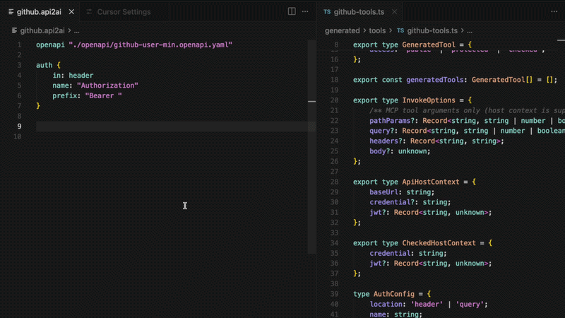

# api2ai

> **Pre-release** --- early access; APIs, DSL, and generated output may
> change before v1.0.

## Turn any OpenAPI specification into curated MCP tools.

Generate MCP tools from existing APIs --- without writing custom MCP
servers.

---

## Get Started

The fastest way to try api2ai is with the VSIX extension and the bundled
demo workspace.

### 1. Install the VSIX

Download the latest release:

https://github.com/annettedorothea/api2ai/releases

### 2. Create a Demo Workspace

Open Cursor or VS Code and run:

```text
api2ai: Create demo workspace (MCP examples)
```

### 3. Explore

Open any `.api2ai` file, make a change, and save.

api2ai automatically generates MCP-compatible tools from your OpenAPI
definitions.

No repository checkout required.

---

## Demo



The video shows:

- editing a `.api2ai` file
- automatically generating the MCP tool and server on save
- enabling the generated MCP server in Cursor
- using the generated tool from an AI agent

---

## Example

```api2ai
openapi "./openapi/github-user-min.openapi.yaml"

auth {
    in: header
    name: "Authorization"
    prefix: "Bearer "
}

GET "/user" {
    toolName: getGitHubAuthenticatedUser
    access: protected
    intent: "return the GitHub user profile for the authenticated PAT; use to confirm which account the token represents before calling repo-scoped tools"
    summary: "Get the authenticated user"
    example: "No path or query parameters"
}
```

### Flow

```text
OpenAPI
    ↓
.api2ai
    ↓
MCP Tool
    ↓
AI Agent
```

---

## Why api2ai?

Building MCP tools manually usually requires:

- defining tools
- mapping API requests and responses
- maintaining MCP server code
- keeping everything in sync with your API

api2ai lets you focus on describing API capabilities instead of writing
MCP boilerplate.

---

## Documentation

The architecture behind api2ai is documented in core2ai:

- Tool Factory
- Tool Authoring
- AI Runtime
- Personas

https://github.com/annettedorothea/core2ai/tree/main/docs

---

## Related Projects

- **core2ai** -- shared runtime and code generation infrastructure
- **db2ai** -- generate MCP tools from SQL queries and relational
  databases

---

## License

BUSL-1.1
