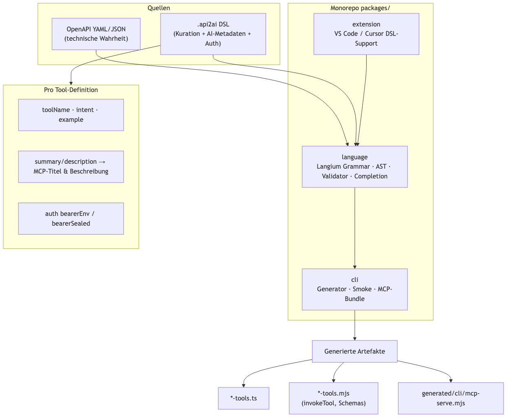
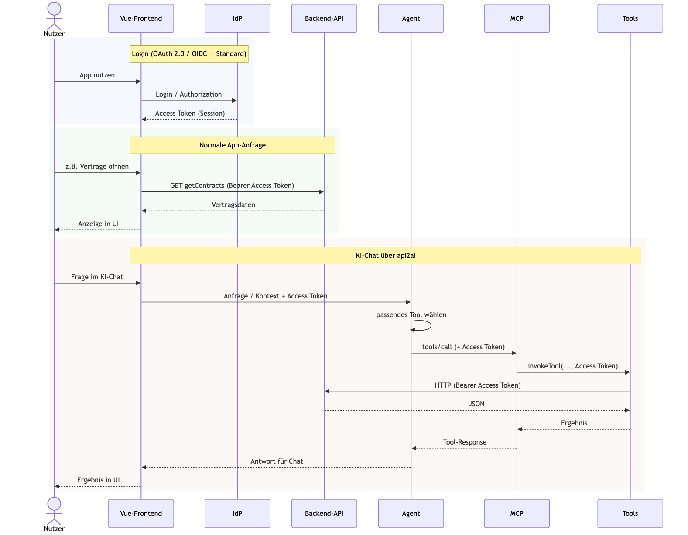
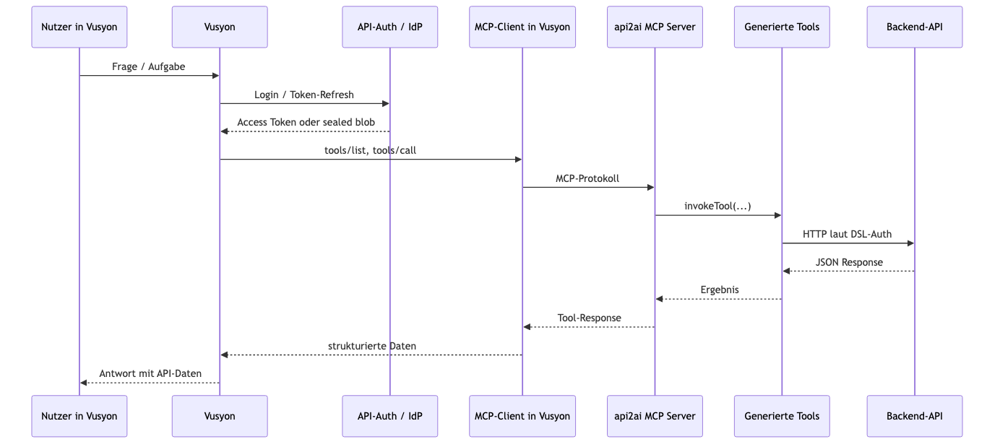
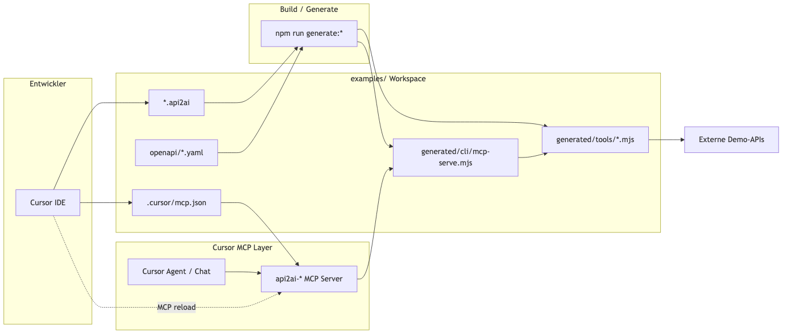

# api2ai — Architektur-Skizzen

Stand: Mai 2026 · PoC api2ai  
Zweck: Präsentation — DSL, Runtime-Szenarien, Vusyon, Entwicklung mit Cursor

---

## 1. DSL-Projekt (Build-Zeit)

Worum es geht: Wie aus OpenAPI + `.api2ai` die generierten Tool-Dateien entstehen — bevor ein Nutzer oder Agent die API aufruft.

| Komponente | Rolle |
|------------|--------|
| `packages/language` | Grammatik, AST, Validierung |
| `packages/cli` | Codegen, Smoke-Tests, MCP-Bundle |
| `packages/extension` | DSL-Editor, Regeneration beim Speichern |

---

## 2. Runtime: Vue-Frontend + api2ai-Tools + MCP + Agent

Worum es geht: Dieselbe Backend-API — einmal klassisch aus dem Vue-FE, einmal über KI-Chat mit Agent und api2ai-Tools.

---

## 3. Vusyon — KI-Produkt über api2ai-Tools

Worum es geht: Nutzer fragt in Vusyon; Vusyon holt Daten über api2ai-Tools von der API — ohne Vue-Frontend.

| Aspekt | Vusyon |
|--------|--------|
| UI | Vusyon, nicht das Vue-FE |
| API-Zugriff | Nur dokumentierte Tools |
| Auth | Vusyon hält Token; Tools setzen Header laut DSL |

---

## 4. Entwicklung: api2ai in Cursor über MCP

Worum es geht: Lokal DSL pflegen, generieren und den Cursor-Agenten gegen Demo-APIs testen.

---

## Szenarien auf einen Blick

| # | Szenario | Diagramm-Typ | Wer spricht die API an? |
|---|----------|--------------|-------------------------|
| 1 | DSL / Build | Flowchart | noch niemand (nur Codegen) |
| 2 | Vue + Tools | Sequenzdiagramm | Vue direkt und über Agent/Tools |
| 3 | Vusyon | Sequenzdiagramm | Vusyon nach Login, nur über Tools |
| 4 | Cursor Dev | Flowchart | Agent in der IDE über MCP |

---

## Dateien in diesem Ordner

| Datei | Zweck |
|-------|--------|
| `architecture-sketches.md` | Dieses Dokument |
| `images/01-dsl-build.png` … `04-cursor-dev.png` | Diagramme für Vorschau und Folien |
| `images/*.mmd` | Quelltext zum Bearbeiten der Diagramme |
